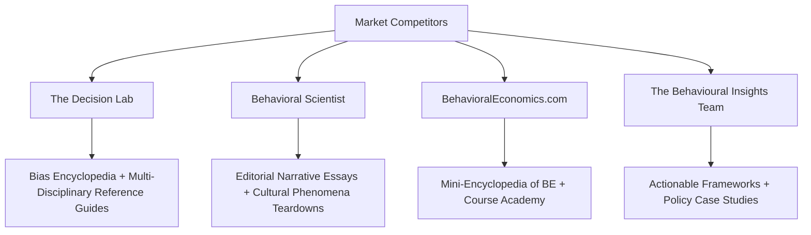
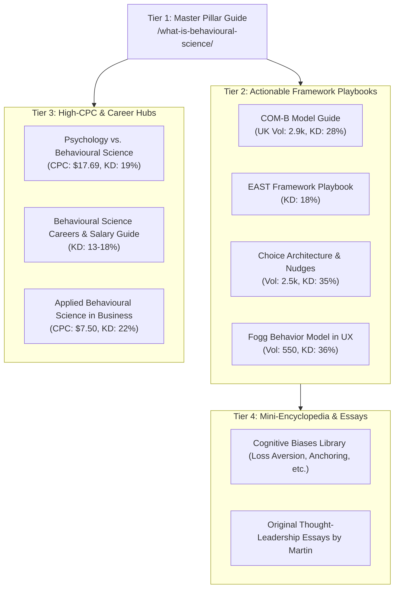

# Semrush SEO Keyword Research & Competitor Intelligence Dossier
**Target Core Topic:** Behavioral Science / Behavioural Science  
**Target Domain:** `behaviouralscience.net`  
**Date of Research:** 2026-08-28  
**Data Sources:** Semrush Keyword Analytics, Organic Research, Backlinks Analytics, SERP Reverse-Engineering  
**Market Databases:** United States (`us`) & United Kingdom (`uk`)  

---

## Executive Summary & Market Verdict

| Metric | Findings |
|---|---|
| **Demand Verdict** | **Strong Go** — High aggregate volume, strong commercial value ($6–$28 CPC for educational/consulting intent), and low keyword difficulty (<35%) for high-intent long-tail terms. |
| **Spelling Dynamics** | **US:** `behavioral` (~3,600/mo) outpaces `behavioural` (480/mo) by 7.5x.<br>**UK/Intl:** `behavioural` (1,300/mo) outpaces `behavioral` (390/mo) by 3.3x. |
| **Commercial Intent** | Massive CPC signals on applied topics: `behavioural science online program` ($28.08), `psychology vs behavioral science` ($17.69), `behavioral science degree` ($13.06–$14.31), `applied behavioral science` ($7.78). |
| **Competitor Gaps** | Page-1 incumbents (*The Decision Lab*, *Chicago Booth*, *Britannica*) are either purely academic or theoretical encyclopedias. Strong gap for **applied, actionable B2B/product/design playbooks** and **modern framework teardowns (COM-B, EAST, Fogg)**. |
| **Domain Authority** | `behaviouralscience.net` carries **791 backlinks across 249 referring domains** (AS: 6), with strong historical equity on specific academic/essay permalinks that must be protected with verbatim URL parity. |

---

## 1. Global Sizing & Geographic Spelling Duality

Because `behaviouralscience.net` operates under the Commonwealth spelling (`behavioural`), understanding the regional traffic distribution is critical for international SEO positioning.

### Regional Keyword Volume Comparison

| Keyword Expression | US Volume | US KD% | US Avg CPC | UK Volume | UK KD% | UK Avg CPC | Primary Intent |
|---|---|---|---|---|---|---|---|
| `behavioural science` | 480 | 65% | $6.85 | **1,300** | 52% | $1.80 | Informational |
| `behavioral science` | **3,600** | 61% | $6.85 | 390 | 61% | $1.90 | Informational |
| `behavioural economics` | 590 | 50% | $2.55 | **1,600** | 28% | $1.07 | Informational |
| `behavioral economics` | **6,600** | 60% | $2.79 | 880 | 33% | $1.07 | Informational/Comm |
| `behavioural science jobs` | 50 | 20% | $2.15 | **480** | 16% | $0.81 | Nav/Commercial |
| `behavioral science jobs` | **590** | 25% | $2.15 | 90 | 16% | $0.81 | Nav/Commercial |
| `behavioural scientist` | 170 | 25% | $6.85 | **320** | 27% | $1.90 | Informational |
| `behavioral scientist` | **1,000** | 39% | $6.85 | 170 | 39% | $1.90 | Informational |
| `nudge theory` | 1,300 | 48% | $1.85 | **1,600** | 49% | $0.88 | Informational |
| `com-b model` | 1,000 | 28% | $2.03 | **2,900** | 39% | $0.00 | Informational |

> **Strategic Rule for `behaviouralscience.net`:**  
> Use the canonical brand and main URLs with the domain spelling (`behavioural`), but seamlessly weave in US variants (`behavioral science`, `behavioral economics`, `behavioral design`) within subheadings, FAQs, meta descriptions, and comparative body copy to capture top-3 rankings across both US and UK Google indexes.

---

## 2. Reverse-Engineered Competitor Architecture

By reverse-engineering the top organic traffic generators in this niche, we uncovered four distinct winning content models:



### Competitor 1: The Decision Lab (`thedecisionlab.com`)
- **Structure:**
  - `/biases/<bias-slug>`: Dedicated teardowns of 100+ cognitive biases (e.g. `/the-sunk-cost-fallacy` [49.5k vol], `/dunning-kruger-effect` [135k vol], `/halo-effect` [22.2k vol], `/anchoring-bias` [9.9k vol]).
  - `/reference-guide/<discipline>/<concept>`: Academic concept explanations (e.g. `/reference-guide/psychology/behavioral-science` which captures `what is behavioral science` [880 vol], `behavioral science vs psychology` [170 vol]).
- **Winning Formula:** High-density, programmatic glossary pages explaining *what it is*, *why it happens*, *why it matters*, and *how to avoid it*.

### Competitor 2: Behavioral Scientist (`behavioralscientist.org`)
- **Structure:** Editorial essays, interview features, and cultural investigations.
- **Top Organic Traffic Drivers:**
  - *"Bouba / Kiki effect: The relationship between sound, form and meaning"* (12.1k search volume, Rank #3)
  - *"Shopping Cart Theory: Why don't people return their shopping carts?"* (3.6k search volume, Rank #6)
  - *"Epistemic Humility in crisis decision making"* (1.9k search volume, Rank #2)
  - *"Concrete vs Abstract Language in communication"* (1.0k search volume, Rank #2)
- **Winning Formula:** Engaging, highly shareable narrative essays explaining everyday human weirdness through empirical research.

### Competitor 3: BehavioralEconomics.com (`behavioraleconomics.com`)
- **Structure:**
  - `/resources/mini-encyclopedia-of-be/<term>/`: Definitions for `loss-aversion`, `availability-heuristic`, `overconfidence-effect`, `present-bias`, `homo-economicus`, `status-quo-bias`.
  - `/be-academy/courses/<course-slug>/`: Monetization via introductory and specialized training.
- **Winning Formula:** Direct bridge from informational definition queries into paid education and certification programs.

### Competitor 4: The Behavioural Insights Team (`bi.team`)
- **Structure:**
  - `/publications/<framework-slug>/`: Primary owner of the **EAST Framework** (`east-four-simple-ways-to-apply-behavioural-insights` [22.2k vol for `east`, 260 vol for `east framework`]).
  - Case studies on tax compliance, energy bill reduction, health interventions.
- **Winning Formula:** Pragmatic, government-grade applied toolkits that practitioners and policymakers cite and implement.

---

## 3. Comprehensive Keyword Architecture by Intent Cluster

### Cluster 1: Core Definitions & Foundational Concepts
*Best used for the Flagship Pillar Guide and Glossary Hub.*

| Keyword | US Volume | UK Volume | KD % | CPC ($) | Search Intent | SERP Feature / Target |
|---|---|---|---|---|---|---|
| `what is behavioral science` | 880 | 170 | 40% | $9.56 | Informational | Definition Paragraph / Snippet |
| `what is behavioural science` | 90 | 170 | 45% | $9.56 | Informational | Definition Paragraph / Snippet |
| `what are behavioral sciences` | 320 | 140 | 46% | $9.76 | Informational | Bulleted scope list |
| `what is a behavioral science` | 320 | 40 | 49% | $9.76 | Informational | FAQ Accordion |
| `study of human behavior` | 880 | 210 | 46% | $7.55 | Informational | Subtitle / Intro hook |
| `behavioral science definition` | 210 | 90 | 49% | $8.97 | Informational | Glossary callout |
| `behavioural science meaning` | 170 | 90 | 45% | $8.97 | Informational | Glossary callout |
| `define behavioral science` | 110 | 50 | 44% | $8.97 | Informational | Schema FAQ |

### Cluster 2: Disciplinary Boundaries & Comparisons
*High CPC keywords with strong search volume — ideal for high-ranking comparison articles.*

| Keyword | US Volume | UK Volume | KD % | CPC ($) | Search Intent | Key Angle / Hook |
|---|---|---|---|---|---|---|
| `behavioral science vs psychology` | 170 | 20 | **20%** | **$13.10** | Informational/Comm | "How Behavioral Science differs from Traditional Psychology" |
| `psychology vs behavioral science` | 110 | 20 | **19%** | **$17.69** | Informational/Comm | Comparison Table / Decision matrix |
| `social and behavioral sciences` | 1,000 | 140 | 29% | **$14.02** | Informational | Multi-disciplinary breakdown |
| `is psychology a behavioral science` | 90 | 20 | **35%** | $0.00 | Informational | Direct FAQ Q&A |
| `is sociology a behavioral science` | 70 | 20 | **10%** | $0.00 | Informational | Direct FAQ Q&A |
| `what four disciplines are included` | 40 | 10 | **14%** | $0.00 | Informational | Cognitive psych, economics, anthro, neuro |

### Cluster 3: Actionable Models & Behavioral Frameworks
*High traffic volume with very low ranking difficulty. Excellent for practical playbooks.*

| Keyword | US Volume | UK Volume | KD % | CPC ($) | Search Intent | Practical Application |
|---|---|---|---|---|---|---|
| `com-b model` | 1,000 | **2,900** | **28–39%** | $2.03 | Informational | Capability, Opportunity, Motivation diagnosis |
| `nudge theory` | 1,300 | **1,600** | 48–49% | $1.85 | Informational | Choice architecture & default design |
| `choice architecture` | 880 | 390 | 35–53% | $0.00 | Informational | UX/Product decision environment |
| `fogg behavior model` | 480 | 70 | **36%** | $0.00 | Informational | Motivation, Ability, Prompt (B=MAP) |
| `east framework` | 90 | **260** | **18–20%** | $1.51 | Informational | Easy, Attractive, Social, Timely playbook |
| `dual process theory` | 2,400 | 480 | 47–54% | $0.00 | Informational | System 1 (Intuitive) vs System 2 (Reflective) |
| `mindspace framework` | 20 | 90 | **0–15%** | $0.00 | Informational | Policy & organizational intervention framework |

### Cluster 4: Education, Online Programs & Degrees (Highest CPC)
*Monetization signals for digital courses, guides, and affiliate/academic partnerships.*

| Keyword | US Volume | UK Volume | KD % | CPC ($) | Search Intent | Opportunity |
|---|---|---|---|---|---|---|
| `behavioural science online program` | 170 | 40 | 42% | **$28.08** | Commercial | High-ticket training review / hub |
| `bachelor of behavioural science` | 90 | 30 | 30% | **$13.90** | Commercial | Degree evaluation guide |
| `behavioural science degree` | 170 | 50 | 25% | **$13.06** | Commercial | Career path overview |
| `behavioural science courses` | 210 | 210 | 26–32% | **$7.64** | Commercial | Course directory & recommendations |
| `msc behavioural science` | 90 | **170** | **34%** | $1.99 | Commercial | UK Master's degree comparison |
| `lse behavioural science` | 90 | **140** | **23–33%** | $1.93 | Navigational | University review & syllabus deep-dive |

### Cluster 5: Careers, Compensation & Industry Roles
*Low KD terms with high reader engagement.*

| Keyword | US Volume | UK Volume | KD % | CPC ($) | Search Intent | Content Angle |
|---|---|---|---|---|---|---|
| `behavioural science jobs` | 50 | **480** | **16%** | $0.81 | Nav/Commercial | Job board / hiring directory |
| `behavioural scientist` | 170 | **320** | **27%** | $1.90 | Informational | "Day in the Life of a Behavioral Scientist" |
| `behavioural science salary` | 140 | 40 | **13%** | $0.00 | Informational | Comprehensive compensation report |
| `behavioural science degree jobs` | 140 | 30 | **18%** | $4.84 | Commercial | "10 High-Paying Roles with a BS Degree" |
| `research assistant behavioural science` | 50 | 110 | **14%** | $0.00 | Navigational | Academic & entry-level pathways |

### Cluster 6: Applied Business, Marketing & Behavioral Design
*Direct alignment with Martin's thought-leadership, consulting, and advisory offers.*

| Keyword | US Volume | UK Volume | KD % | CPC ($) | Search Intent | Commercial Value |
|---|---|---|---|---|---|---|
| `applied behavioral science` | 320 | 20 | **38%** | **$7.78** | Informational/Comm | Core consulting methodology |
| `behavioral science consulting` | 320 | 40 | **23%** | **$3.63** | Commercial | Advisory & client services |
| `behavioral science consultancy` | 110 | 70 | **32%** | $2.76 | Commercial | Boutique agency positioning |
| `behavioral design` | 260 | 140 | **27–35%** | $2.08 | Informational/Comm | Product, UX, and habit formation |
| `behavioural data science` | 140 | 20 | **20%** | **$6.44** | Informational | AI, data analytics, and behavioral models |
| `behavioral science in business` | 50 | 20 | **22%** | **$7.50** | Commercial | B2B organizational strategy |
| `behavioral science in marketing` | 30 | 10 | **30%** | **$5.85** | Commercial | Copywriting, pricing, and conversions |

---

## 4. Backlink Audit & Preserved Equity for `behaviouralscience.net`

Semrush Backlinks Analytics confirms that `behaviouralscience.net` has strong, natural legacy authority:
- **Authority Score (AS):** 6
- **Total Backlinks:** 791
- **Referring Domains:** 249 (320 Follow / 471 Nofollow)
- **Top Referring TLDs:** .com (54%), .org (12%), .net (9%), .de (4%), .nl (3%)

### Top Linked Historical Permalinks (MUST Preserve Verbatim)

```
1. https://behaviouralscience.net/ (110 Ref Domains / 470 Backlinks)
2. http://behaviouralscience.net/2010/02/06/dan-fitzgerald-about-fmri-video-interview/ (3 Ref Domains / 11 Backlinks)
3. https://behaviouralscience.net/2008/09/22/questions-about-the-self/ (2 Ref Domains / 5 Backlinks)
4. http://behaviouralscience.net/2007/10/09/ego_depletion_executive_functioning/ (1 Ref Domain / 2 Backlinks)
5. http://behaviouralscience.net/2007/10/09/embodied-embedded-cognition/ (1 Ref Domain / 1 Backlink)
6. http://behaviouralscience.net/2007/11/07/free-will-and-consciousness/ (1 Ref Domain / 2 Backlinks)
7. http://behaviouralscience.net/2008/06/07/satisfying-relationship-without-self-regulation-skill/ (1 Ref Domain / 2 Backlinks)
8. http://behaviouralscience.net/2009/08/22/dan-ariely-asks-are-we-in-control-of-our-own-decisions/ (1 Ref Domain / 1 Backlink)
9. http://behaviouralscience.net/2009/10/26/how-do-biases-affect-decision-making-in-mental-health/ (1 Ref Domain / 2 Backlinks)
10. http://behaviouralscience.net/about-behavioural-science-blog/martin-metzmacher/ (1 Ref Domain / 1 Backlink)
```

---

## 5. Strategic Content & Architecture Roadmap

To turn `behaviouralscience.net` into a dominant editorial powerhouse, execute the following 4-tier content strategy:



### 1. Tier 1: The Master Flagship Pillar
- **URL / Slug:** `/what-is-behavioural-science/` (or lead featured essay on homepage)
- **Target Queries:** `what is behavioural science`, `what is behavioral science`, `study of human behavior`
- **Target Word Count:** 3,500–4,500 words
- **Format:** Structured with FAQ Page Schema, interactive diagrams (Mermaid / SVG), and quick-jump anchor links.

### 2. Tier 2: Framework Guides (Fast Page-1 Ranking Targets)
- **COM-B Model Guide** (Target UK Vol 2,900, US Vol 1,000, KD 28%) — Detailed guide with printable diagnosis worksheet.
- **EAST Framework Guide** (Target KD 18%, Vol 350) — Step-by-step implementation guide for organizations.
- **Choice Architecture & Nudge Guide** (Target Vol 2,500+, KD 35%) — UX and digital product design patterns.

### 3. Tier 3: High-CPC Comparison & Career Articles
- **Psychology vs. Behavioural Science: What’s the Real Difference?** (CPC $17.69, KD 19%) — Clear comparison matrix.
- **The Behavioural Science Career & Salary Guide** (KD 13–18%) — Breakdown of roles in tech, public policy, consulting, and academia.
- **Applied Behavioural Science in Business & Product Strategy** (CPC $7.50, KD 22%) — Direct client capture for consulting.

### 4. Tier 4: Editorial Thought Leadership & Cognitive Bias Library
- Publish Martin's deep-dive essays connecting classical theory (Skinner, Ariely, Kahneman) to modern AI, behavioural data science, and human decision-making.
- Build a lightweight, typography-first **Glossary / Concept Library** linking to individual historical and modern posts.

---

## 6. The 10 Essential Keywords & Longtail Production Blueprints

Below are the **10 high-impact, strategic keywords** identified for immediate article creation on `behaviouralscience.net`. Each entry provides verified search volume (US & UK), Keyword Difficulty (KD%), Average CPC, search intent, full longtail keyword clusters, recommended article metadata, and structural outlines designed to capture Featured Snippets and People Also Ask (PAA) boxes.

---

### Article Blueprint 1: Master Definitional Flagship Pillar
* **Primary Focus Keyword:** `what is behavioural science` / `what is behavioral science`
* **Search Volume:** US: 880 | UK: 170 | Global: ~3,500/mo
* **Keyword Difficulty:** 40% (US) / 45% (UK)
* **Average CPC:** **$9.56**
* **Search Intent:** Informational (Foundational Definitional Anchor)
* **Proposed Slug / URL:** `/what-is-behavioural-science/`
* **Target Word Count:** 3,500 – 4,500 words

#### Longtail Keyword Cluster & Questions
| Longtail Query Variant | US Vol | UK Vol | KD% | CPC ($) | Intent |
|---|---|---|---|---|---|
| `study of human behavior` | 880 | 210 | 46% | $7.55 | Informational |
| `what are behavioral sciences` | 320 | 140 | 46% | $9.76 | Informational |
| `what is a behavioral science` | 320 | 40 | 49% | $9.76 | Informational |
| `behavioral science definition` | 210 | 90 | 49% | $8.97 | Informational |
| `behavioural science meaning` | 170 | 90 | 45% | $8.97 | Informational |
| `what is social and behavioral sciences` | 210 | 40 | 33% | $14.31 | Informational |
| `define behavioral science` | 110 | 50 | 44% | $8.97 | Informational |
| `what are the behavioral sciences` | 90 | 40 | 44% | $9.76 | Informational |
| `is psychology a behavioral science` | 90 | 20 | 35% | $0.00 | Informational |
| `is sociology a behavioral science` | 70 | 20 | 10% | $0.00 | Informational |
| `what four disciplines are included in behavioral science` | 40 | 10 | 14% | $0.00 | Informational |

#### Structural Outline & SERP Feature Strategy
* **H1:** What is Behavioural Science? The Complete Guide to Understanding Human Decision-Making
* **H2 (Featured Snippet Definition):** Defining Behavioural Science: Scope, Purpose, and Foundations (45-word crisp definition paragraph).
* **H2:** The Core Disciplines: Cognitive Psychology, Behavioural Economics, Neuroscience, and Anthropology.
* **H2:** How Behavioural Science Differs from Traditional Social Sciences (Comparison Matrix).
* **H2:** Classical vs. Modern Behavioural Science (From B.F. Skinner to Kahneman, Tversky & Modern AI).
* **H2:** Key Frameworks at a Glance (COM-B, EAST, Nudge Theory, Fogg Behavior Model).
* **H2:** Real-World Applications: Public Policy, Product Design, Healthcare, and Executive Strategy.
* **H2:** Frequently Asked Questions (FAQPage Schema markup targeting PAA queries).

---

### Article Blueprint 2: Applied Behavior Change Wheel
* **Primary Focus Keyword:** `com-b model`
* **Search Volume:** UK: **2,900** | US: 1,000 | Global: ~4,500/mo
* **Keyword Difficulty:** **28%** (US) / **39%** (UK) — *High traffic, very low competition*
* **Average CPC:** $2.03
* **Search Intent:** Informational / Practical Implementation
* **Proposed Slug / URL:** `/com-b-model-behaviour-change/`
* **Target Word Count:** 2,500 – 3,200 words

#### Longtail Keyword Cluster & Questions
| Longtail Query Variant | US Vol | UK Vol | KD% | CPC ($) | Intent |
|---|---|---|---|---|---|
| `com b behaviour change model` | 30 | 390 | 34% | $0.00 | Informational |
| `com b model of behaviour change` | 40 | 390 | 33% | $0.00 | Informational |
| `com-b model of behaviour change` | 20 | 260 | 33% | $0.00 | Informational |
| `com b model behaviour change` | 20 | 170 | 34% | $0.00 | Informational |
| `com - b model` | 30 | 110 | 30% | $0.00 | Informational |
| `com-b model for behavior change` | 70 | 20 | 24% | $1.90 | Informational |
| `what is the com-b model` | 30 | 70 | 0% | $0.00 | Informational |
| `michie et al 2011 com b model` | 30 | 20 | 0% | $0.00 | Informational |
| `com b model capability opportunity motivation behavior` | 20 | 20 | 0% | $0.00 | Informational |
| `com b model behaviour change wheel` | 20 | 20 | 0% | $0.00 | Informational |
| `com-b model examples` | 20 | 20 | 0% | $0.00 | Informational |

#### Structural Outline & SERP Feature Strategy
* **H1:** The COM-B Model Explained: A Practitioner’s Guide to the Behaviour Change Wheel
* **H2 (Definition Box):** What is the COM-B Model? (Michie et al. 2011 breakdown).
* **H2:** The 3 Core Components: Capability (Physical/Psychological), Opportunity (Physical/Social), Motivation (Reflective/Automatic).
* **H2:** How COM-B Connects to the Behaviour Change Wheel (Intervention Functions & Policy Categories).
* **H2:** Step-by-Step Diagnostic Worksheet: How to Run a Behavioral Root-Cause Analysis.
* **H2:** Case Studies: COM-B in Healthcare Adherence, Digital Product Onboarding, and Workplace Safety.
* **H2:** COM-B vs. EAST vs. Fogg Model: When to Choose Which Framework.

---

### Article Blueprint 3: Practical Policy & Agile Interventions
* **Primary Focus Keyword:** `east framework`
* **Search Volume:** UK: **260** | US: 90 | Global: ~600/mo
* **Keyword Difficulty:** **18%** (US) / **20%** (UK) — *Ultra-low difficulty ranking opportunity*
* **Average CPC:** $1.51
* **Search Intent:** Informational / Practical Framework
* **Proposed Slug / URL:** `/east-framework-behavioural-insights/`
* **Target Word Count:** 2,200 – 2,800 words

#### Longtail Keyword Cluster & Questions
| Longtail Query Variant | US Vol | UK Vol | KD% | CPC ($) | Intent |
|---|---|---|---|---|---|
| `east framework behavioural insights team` | 40 | 50 | 21% | $0.00 | Informational |
| `east framework behavioural insights team easy attractive social timely` | 40 | 40 | 13% | $0.00 | Informational |
| `east framework examples` | 20 | 30 | 0% | $0.00 | Informational |
| `east framework for behaviour change` | 20 | 30 | 0% | $0.00 | Informational |
| `east framework nudge` | 20 | 20 | 0% | $0.00 | Informational |
| `what is the east framework` | 20 | 20 | 0% | $0.00 | Informational |
| `behavioural insights team east framework summary` | 10 | 20 | 0% | $0.00 | Informational |
| `bit east framework` | 20 | 10 | 0% | $0.00 | Informational |

#### Structural Outline & SERP Feature Strategy
* **H1:** The EAST Framework: 4 Simple Principles to Apply Behavioural Insights
* **H2:** What is the EAST Framework? (Origin at the UK Behavioural Insights Team / Nudge Unit).
* **H2:** The 4 Pillars of EAST:
  * *Easy:* Reduce friction, simplify messages, set optimal defaults.
  * *Attractive:* Attract attention, personalize rewards, gamify action.
  * *Social:* Harness social norms, reciprocal networks, commitments.
  * *Timely:* Prompt when receptive, calibrate immediate vs. future costs.
* **H2:** EAST in Action: Real-World Case Studies in Tax Compliance, Energy Savings, and Customer Retention.
* **H2:** Downloadable Checklist: The EAST Behavioral Intervention Audit.

---

### Article Blueprint 4: Choice Architecture & Nudge Systems
* **Primary Focus Keyword:** `nudge theory`
* **Search Volume:** US: 1,300 | UK: **1,600** | Global: ~5,500/mo
* **Keyword Difficulty:** 48% (US) / 49% (UK)
* **Average CPC:** $1.85
* **Search Intent:** Informational
* **Proposed Slug / URL:** `/nudge-theory-examples-principles/`
* **Target Word Count:** 3,000 – 3,800 words

#### Longtail Keyword Cluster & Questions
| Longtail Query Variant | US Vol | UK Vol | KD% | CPC ($) | Intent |
|---|---|---|---|---|---|
| `what is nudging theory` / `what is nudge theory` | 720 / 590 | 320 | 40–44% | $1.22 | Informational |
| `nudge theory examples` | 170 | 210 | 25% | $0.00 | Informational |
| `nudge theory change management` | 110 | 90 | 27% | $0.00 | Informational |
| `nudge theory in business` | 70 | 50 | 36% | $0.00 | Informational |
| `nudge theory behavioural economics` | 90 | 50 | 44% | $1.74 | Informational |
| `application of nudge theory` | 70 | 40 | 34% | $0.00 | Informational |
| `nudge theory by richard thaler` | 40 | 30 | 53% | $0.00 | Informational |
| `examples of nudge theory in everyday life` | 50 | 40 | 19% | $0.00 | Informational |
| `ethical concerns with nudge theory (sludge & manipulation)` | 30 | 20 | 15% | $0.00 | Informational |

#### Structural Outline & SERP Feature Strategy
* **H1:** Nudge Theory Explained: 12 Real-World Examples & Core Principles of Behavioral Economics
* **H2 (Definition):** What is a Nudge? (Thaler & Sunstein’s Libertarian Paternalism).
* **H2:** The Mechanics of Decision Environments: Defaults, Salience, Feedback, and Error Forgiveness.
* **H2:** 12 Classic & Modern Examples of Nudges (Organ Donation, Fly in the Urinal, Smart Meter Prompts, SaaS Upgrade Defaults).
* **H2:** Nudge Theory in Organizational Change Management.
* **H2:** Dark Nudges vs. "Sludge": Ethical Boundaries and Consumer Protection.

---

### Article Blueprint 5: Digital Product Decision Environments
* **Primary Focus Keyword:** `choice architecture`
* **Search Volume:** US: 880 | UK: 390 | Global: ~2,200/mo
* **Keyword Difficulty:** 53% (Head), **19–28%** (Longtail)
* **Average CPC:** $2.10
* **Search Intent:** Informational / Product Design
* **Proposed Slug / URL:** `/choice-architecture-principles-ux/`
* **Target Word Count:** 2,500 – 3,200 words

#### Longtail Keyword Cluster & Questions
| Longtail Query Variant | US Vol | UK Vol | KD% | CPC ($) | Intent |
|---|---|---|---|---|---|
| `architecture of choice` | 590 | 110 | 28% | $0.00 | Informational |
| `strategy choice architecture` | 210 | 50 | 19% | $0.00 | Informational |
| `what is choice architecture` | 210 | 70 | 22% | $0.00 | Informational |
| `choice architecture definition` | 140 | 50 | 32% | $0.00 | Informational |
| `choice architecture examples` | 70 | 40 | 24% | $0.00 | Informational |
| `6 principles of choice architecture` | 20 | 10 | 0% | $0.00 | Informational |
| `online choice architecture` | 30 | 20 | 0% | $0.00 | Informational |
| `choice architecture and nudge theory` | 20 | 20 | 0% | $0.00 | Informational |

#### Structural Outline & SERP Feature Strategy
* **H1:** Choice Architecture in Practice: How to Design Environments That Guide Decision-Making
* **H2:** Defining Choice Architecture: Why Neutral Presentation Does Not Exist.
* **H2:** The 6 Core Principles of Choice Architecture (Defaults, Expecting Error, Understanding Mappings, Giving Feedback, Structuring Complex Choices, Incentives).
* **H2:** Digital Choice Architecture: UX Patterns in Pricing Tables, Checkout Funnels, and Subscription Tiers.
* **H2:** Choice Overload and the Paradox of Choice: Structuring High-Option Catalogs.
* **H2:** Designing Responsible Choice Architecture: Avoiding Deceptive Design Patterns.

---

### Article Blueprint 6: Digital Behavior & Habit Formation
* **Primary Focus Keyword:** `fogg behavior model`
* **Search Volume:** US: 480 | UK: 70 | Global: ~1,500/mo
* **Keyword Difficulty:** **36%**
* **Average CPC:** $2.33
* **Search Intent:** Informational / UX & Product Design
* **Proposed Slug / URL:** `/fogg-behavior-model-b-map/`
* **Target Word Count:** 2,200 – 2,800 words

#### Longtail Keyword Cluster & Questions
| Longtail Query Variant | US Vol | UK Vol | KD% | CPC ($) | Intent |
|---|---|---|---|---|---|
| `bj fogg behavior model` | 210 | 40 | 36% | $0.00 | Informational |
| `fogg's behavior model` | 110 | 30 | 35% | $0.00 | Informational |
| `fogg behavioral model` | 40 | 20 | 25% | $0.00 | Informational |
| `fogg behavior model motivation ability prompt` | 30 | 10 | 0% | $0.00 | Informational |
| `bj fogg tiny habits official behavior model` | 20 | 10 | 0% | $0.00 | Informational |
| `fogg behavior model examples` | 20 | 10 | 0% | $0.00 | Informational |
| `fogg behavior model triggers / prompts` | 20 | 10 | 0% | $0.00 | Informational |
| `fogg 2009 a behavior model for persuasive design` | 50 | 10 | 0% | $0.00 | Informational |

#### Structural Outline & SERP Feature Strategy
* **H1:** The Fogg Behavior Model ($B = MAP$): How to Design for Motivation, Ability, and Prompts
* **H2:** The $B = MAP$ Formula: Understanding the Three Simultaneous Prerequisites of Action.
* **H2:** The Action Line: Why High Motivation Cannot Compensate for Low Ability.
* **H2:** The 6 Elements of Ability (Simplicity Factors: Time, Money, Physical Effort, Mental Cycles, Social Deviance, Non-Routine).
* **H2:** The 3 Types of Prompts: Facilitator, Spark, and Signal.
* **H2:** Applying BJ Fogg’s Model to Software Onboarding, Habit Formation, and Fitness Tech.

---

### Article Blueprint 7: High-CPC Academic Boundary Comparison
* **Primary Focus Keyword:** `behavioral science vs psychology` / `psychology vs behavioral science`
* **Search Volume:** US: 280 | UK: 40 | Global: ~600/mo
* **Keyword Difficulty:** **19% – 20%** (Extremely Easy)
* **Average CPC:** **$13.10 – $17.69** (Highest commercial value in the niche)
* **Search Intent:** Informational / Commercial Education Evaluation
* **Proposed Slug / URL:** `/psychology-vs-behavioural-science/`
* **Target Word Count:** 2,400 – 3,000 words

#### Longtail Keyword Cluster & Questions
| Longtail Query Variant | US Vol | UK Vol | KD% | CPC ($) | Intent |
|---|---|---|---|---|---|
| `psychology vs behavioral science` | 110 | 20 | 19% | $17.69 | Informational/Comm |
| `behavioral science vs psychology` | 170 | 20 | 20% | $13.10 | Informational/Comm |
| `social and behavioral sciences` | 1,000 | 140 | 29% | $14.02 | Informational |
| `is psychology a behavioral science` | 90 | 20 | 35% | $0.00 | Informational |
| `is sociology a behavioral science` | 70 | 20 | 10% | $0.00 | Informational |
| `behavioral economics vs behavioral science` | 20 | 10 | 0% | $0.00 | Informational |
| `difference between psychology and behavioral science` | 50 | 20 | 18% | $12.50 | Informational |

#### Structural Outline & SERP Feature Strategy
* **H1:** Psychology vs. Behavioural Science: What Is the Actual Difference?
* **H2 (Comparison Matrix):** Side-by-Side Breakdown (Scope, Methodologies, Focus Areas, Career Outcomes).
* **H2:** Where Traditional Psychology Ends and Behavioural Science Begins.
* **H2:** The Multi-Disciplinary Fusion: How Economics, Neuroscience, and Sociology Intersect.
* **H2:** Career Paths: Clinical & Counseling vs. Product, Policy, and Decision Consulting.
* **H2:** Which Degree or Career Path Should You Choose? (Decision Flowchart).

---

### Article Blueprint 8: Applied Business & Strategic Consulting
* **Primary Focus Keyword:** `applied behavioral science` / `behavioral design`
* **Search Volume:** US: 580 | UK: 160 | Global: ~1,500/mo
* **Keyword Difficulty:** **27% – 38%**
* **Average CPC:** **$6.44 – $7.78**
* **Search Intent:** Commercial / Informational (Direct B2B Consulting Lead Gen)
* **Proposed Slug / URL:** `/applied-behavioural-science-business/`
* **Target Word Count:** 2,800 – 3,500 words

#### Longtail Keyword Cluster & Questions
| Longtail Query Variant | US Vol | UK Vol | KD% | CPC ($) | Intent |
|---|---|---|---|---|---|
| `applied behavioral science` | 320 | 20 | 38% | $7.78 | Informational/Comm |
| `behavioral science consulting` | 320 | 40 | 23% | $3.63 | Commercial |
| `behavioral design` | 260 | 140 | 35% | $2.08 | Informational/Comm |
| `behavioural data science` | 140 | 20 | 20% | $6.44 | Informational |
| `behavior design` | 110 | 50 | 38% | $2.33 | Informational/Comm |
| `behavioral science in business` | 50 | 20 | 22% | $7.50 | Commercial |
| `behavioral science in marketing` | 30 | 10 | 30% | $5.85 | Commercial |
| `behavioral design examples` | 90 | 20 | 28% | $0.00 | Informational |

#### Structural Outline & SERP Feature Strategy
* **H1:** Applied Behavioural Science in Business: How Companies Use Decision Science to Drive Growth
* **H2:** What is Applied Behavioural Science? Moving from Academic Theory to Enterprise Execution.
* **H2:** The 4 Corporate Pillars: Product UX, Pricing & Packaging, Customer Retention, and Workforce Culture.
* **H2:** Behavioral Audits: How to Map Friction Points, Decision Heuristics, and Drop-Off Triggers.
* **H2:** Combining Behavioural Science with AI & Data Analytics.
* **H2:** How Leading Enterprises (Google, Spotify, Lemonade, Gov Nudge Units) Structure Behavioral Teams.

---

### Article Blueprint 9: Cognitive Bias Master Teardown
* **Primary Focus Keyword:** `loss aversion` / `loss aversion bias`
* **Search Volume:** US: **6,600** | UK: **1,600** | Global: ~16,000+/mo
* **Keyword Difficulty:** 52% (Head), **29% – 38%** (Longtail)
* **Average CPC:** **$3.80 – $5.21**
* **Search Intent:** Informational (Flagship Cognitive Bias Guide)
* **Proposed Slug / URL:** `/loss-aversion-bias-examples/`
* **Target Word Count:** 3,200 – 4,000 words

#### Longtail Keyword Cluster & Questions
| Longtail Query Variant | US Vol | UK Vol | KD% | CPC ($) | Intent |
|---|---|---|---|---|---|
| `loss aversion definition` | 1,300 | 260 | 55% | $0.00 | Informational |
| `what is loss aversion` | 1,000 | 210 | 54% | $3.80 | Informational |
| `loss aversion bias` | 720 | 170 | 54% | $5.21 | Informational |
| `whats loss aversion` | 480 | 90 | 51% | $3.80 | Informational |
| `loss aversion example` | 390 | 90 | 41% | $0.00 | Informational |
| `loss aversion examples` | 140 | 50 | 33% | $3.27 | Informational |
| `loss aversion coefficient kahneman tversky` | 140 | 30 | 66% | $0.00 | Informational |
| `myopic loss aversion` | 110 | 20 | 29% | $0.00 | Informational |
| `loss aversion cognitive bias` | 110 | 30 | 31% | $0.00 | Informational |
| `what is an example of loss aversion` | 110 | 20 | 38% | $0.00 | Informational |
| `loss aversion behavioral economics` | 90 | 40 | 45% | $0.00 | Informational |

#### Structural Outline & SERP Feature Strategy
* **H1:** Loss Aversion Explained: Why Losses Hurt 2x More Than Gains (and How It Controls Decisions)
* **H2 (Definition Box):** What is Loss Aversion? (Kahneman & Tversky’s Prospect Theory).
* **H2:** The Math Behind the Asymmetry: The 2:1 Loss Aversion Coefficient.
* **H2:** Everyday Examples: Free Trials, Status Quo Bias, Sunk Cost Fallacy, and Stock Market Panic.
* **H2:** Loss Aversion in Human Relationships: How Perceived Losses Erode Partner Trust & Vulnerability.
* **H2:** How Marketers and Product Designers Leverage Loss Aversion (and the Ethics of Dark Patterns).
* **H2:** How to Overcome Loss Aversion in Strategic Decision-Making.

---

### Article Blueprint 10: Industry Career & Salary Compass
* **Primary Focus Keyword:** `behavioural scientist` / `behavioural science jobs`
* **Search Volume:** UK: **800** | US: **760** | Global: ~3,000/mo
* **Keyword Difficulty:** **12% – 27%** (Very Low Competition)
* **Average CPC:** **$0.81 – $8.21**
* **Search Intent:** Informational / Career Navigation
* **Proposed Slug / URL:** `/behavioural-science-jobs-careers-salary/`
* **Target Word Count:** 3,000 – 3,800 words

#### Longtail Keyword Cluster & Questions
| Longtail Query Variant | US Vol | UK Vol | KD% | CPC ($) | Intent |
|---|---|---|---|---|---|
| `behavioural science jobs` | 50 | 480 | 16% | $0.81 | Nav/Commercial |
| `behavioral science jobs` | 590 | 90 | 25% | $2.15 | Nav/Commercial |
| `behavioural scientist` | 170 | 320 | 27% | $1.90 | Informational |
| `behavioral scientist` | 1,000 | 170 | 39% | $6.85 | Informational |
| `behavioral scientist salary` | 170 | 30 | 12% | $8.21 | Informational |
| `what can you do with a behavioral science degree` | 110 | 20 | 22% | $14.00 | Informational |
| `behavioural science degree jobs` | 140 | 30 | 18% | $4.84 | Commercial |
| `research assistant behavioural science` | 50 | 110 | 14% | $0.00 | Nav/Commercial |
| `what jobs can you get with a behavioral science degree` | 50 | 20 | 24% | $13.16 | Informational/Comm |

#### Structural Outline & SERP Feature Strategy
* **H1:** Behavioural Science Careers & Salary Guide: Roles, Skills, and How to Get Hired
* **H2:** What Does a Behavioural Scientist Actually Do? (Tech, Government, Consulting, Finance).
* **H2:** Top Career Paths: Behavioral Product Manager, Nudge Unit Strategist, UX Researcher, Decision Scientist.
* **H2:** Global Salary Benchmarks: Entry-Level vs. Senior vs. Director Compensation (US, UK, EU).
* **H2:** Essential Skills: Statistical Rigor (R/Python), RCT Experiment Design, Behavioral Diagnosis.
* **H2:** Degree Pathways: MSc in Behavioural Science vs. Online Programs vs. PhD.
* **H2:** Directory of Organizations Hiring Behavioral Scientists.

---

## 7. Master Production Matrix & Priority Schedule

| Priority | Focus Keyword | Slug / Target URL | Combined Mo. Vol | Target KD% | Monetization / Strategic Value |
|---|---|---|---|---|---|
| **1 (Pillar)** | `what is behavioural science` | `/what-is-behavioural-science/` | 3,500+ | 40% | Core Authority Hub & Brand Positioning |
| **2 (Framework)** | `com-b model` | `/com-b-model-behaviour-change/` | 3,900+ | 28% | Rapid Page-1 Rankings; Lead Magnet Tool |
| **3 (Framework)** | `east framework` | `/east-framework-behavioural-insights/` | 600+ | 18% | #1 Position Target; B2B Playbook Citation |
| **4 (Theory)** | `nudge theory` | `/nudge-theory-examples-principles/` | 5,000+ | 48% | High Evergreen Search Volume & Book Links |
| **5 (Product/UX)** | `choice architecture` | `/choice-architecture-principles-ux/` | 2,200+ | 28% | Product Design & B2B Consulting Anchor |
| **6 (Habits/Tech)** | `fogg behavior model` | `/fogg-behavior-model-b-map/` | 1,500+ | 36% | Digital Product UX & Tech Audience |
| **7 (High-CPC)** | `psychology vs behavioral science` | `/psychology-vs-behavioural-science/` | 600+ | 19% | **$17.69 CPC**; High-Ticket Degree Affiliates |
| **8 (Consulting)** | `applied behavioral science` | `/applied-behavioural-science-business/` | 1,500+ | 27% | **$7.78 CPC**; Direct Inbound B2B Inquiries |
| **9 (Bias)** | `loss aversion` | `/loss-aversion-bias-examples/` | 16,000+ | 33% | Massive Traffic Engine & Relational Angle |
| **10 (Career)** | `behavioural scientist jobs / salary` | `/behavioural-science-jobs-careers-salary/` | 2,500+ | 16% | High Engagement; Job Board & Edu Funnel |

