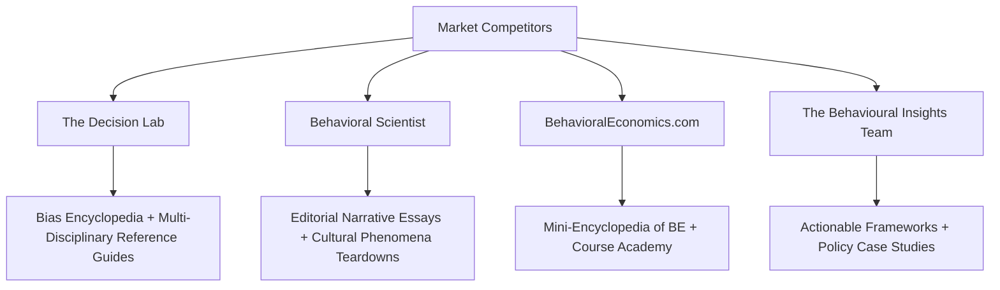
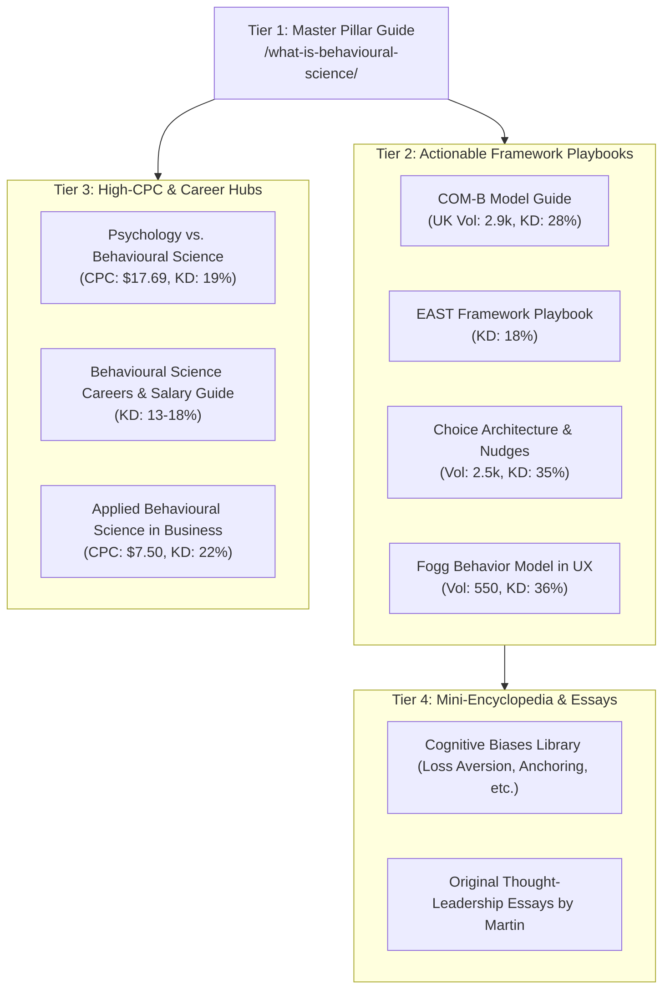

# Semrush SEO Keyword Research & Competitor Intelligence Dossier
**Target Core Topic:** Behavioral Science / Behavioural Science  
**Target Domain:** `behaviouralscience.net`  
**Date of Research:** 2026-08-28  
**Data Sources:** Semrush Keyword Analytics, Organic Research, Backlinks Analytics, SERP Reverse-Engineering  
**Market Databases:** United States (`us`) & United Kingdom (`uk`)  

---

## Executive Summary & Market Verdict

| Metric | Findings |
|---|---|
| **Demand Verdict** | **Strong Go** — High aggregate volume, strong commercial value ($6–$28 CPC for educational/consulting intent), and low keyword difficulty (<35%) for high-intent long-tail terms. |
| **Spelling Dynamics** | **US:** `behavioral` (~3,600/mo) outpaces `behavioural` (480/mo) by 7.5x.<br>**UK/Intl:** `behavioural` (1,300/mo) outpaces `behavioral` (390/mo) by 3.3x. |
| **Commercial Intent** | Massive CPC signals on applied topics: `behavioural science online program` ($28.08), `psychology vs behavioral science` ($17.69), `behavioral science degree` ($13.06–$14.31), `applied behavioral science` ($7.78). |
| **Competitor Gaps** | Page-1 incumbents (*The Decision Lab*, *Chicago Booth*, *Britannica*) are either purely academic or theoretical encyclopedias. Strong gap for **applied, actionable B2B/product/design playbooks** and **modern framework teardowns (COM-B, EAST, Fogg)**. |
| **Domain Authority** | `behaviouralscience.net` carries **791 backlinks across 249 referring domains** (AS: 6), with strong historical equity on specific academic/essay permalinks that must be protected with verbatim URL parity. |

---

## 1. Global Sizing & Geographic Spelling Duality

Because `behaviouralscience.net` operates under the Commonwealth spelling (`behavioural`), understanding the regional traffic distribution is critical for international SEO positioning.

### Regional Keyword Volume Comparison

| Keyword Expression | US Volume | US KD% | US Avg CPC | UK Volume | UK KD% | UK Avg CPC | Primary Intent |
|---|---|---|---|---|---|---|---|
| `behavioural science` | 480 | 65% | $6.85 | **1,300** | 52% | $1.80 | Informational |
| `behavioral science` | **3,600** | 61% | $6.85 | 390 | 61% | $1.90 | Informational |
| `behavioural economics` | 590 | 50% | $2.55 | **1,600** | 28% | $1.07 | Informational |
| `behavioral economics` | **6,600** | 60% | $2.79 | 880 | 33% | $1.07 | Informational/Comm |
| `behavioural science jobs` | 50 | 20% | $2.15 | **480** | 16% | $0.81 | Nav/Commercial |
| `behavioral science jobs` | **590** | 25% | $2.15 | 90 | 16% | $0.81 | Nav/Commercial |
| `behavioural scientist` | 170 | 25% | $6.85 | **320** | 27% | $1.90 | Informational |
| `behavioral scientist` | **1,000** | 39% | $6.85 | 170 | 39% | $1.90 | Informational |
| `nudge theory` | 1,300 | 48% | $1.85 | **1,600** | 49% | $0.88 | Informational |
| `com-b model` | 1,000 | 28% | $2.03 | **2,900** | 39% | $0.00 | Informational |

> **Strategic Rule for `behaviouralscience.net`:**  
> Use the canonical brand and main URLs with the domain spelling (`behavioural`), but seamlessly weave in US variants (`behavioral science`, `behavioral economics`, `behavioral design`) within subheadings, FAQs, meta descriptions, and comparative body copy to capture top-3 rankings across both US and UK Google indexes.

---

## 2. Reverse-Engineered Competitor Architecture

By reverse-engineering the top organic traffic generators in this niche, we uncovered four distinct winning content models:



### Competitor 1: The Decision Lab (`thedecisionlab.com`)
- **Structure:**
  - `/biases/<bias-slug>`: Dedicated teardowns of 100+ cognitive biases (e.g. `/the-sunk-cost-fallacy` [49.5k vol], `/dunning-kruger-effect` [135k vol], `/halo-effect` [22.2k vol], `/anchoring-bias` [9.9k vol]).
  - `/reference-guide/<discipline>/<concept>`: Academic concept explanations (e.g. `/reference-guide/psychology/behavioral-science` which captures `what is behavioral science` [880 vol], `behavioral science vs psychology` [170 vol]).
- **Winning Formula:** High-density, programmatic glossary pages explaining *what it is*, *why it happens*, *why it matters*, and *how to avoid it*.

### Competitor 2: Behavioral Scientist (`behavioralscientist.org`)
- **Structure:** Editorial essays, interview features, and cultural investigations.
- **Top Organic Traffic Drivers:**
  - *"Bouba / Kiki effect: The relationship between sound, form and meaning"* (12.1k search volume, Rank #3)
  - *"Shopping Cart Theory: Why don't people return their shopping carts?"* (3.6k search volume, Rank #6)
  - *"Epistemic Humility in crisis decision making"* (1.9k search volume, Rank #2)
  - *"Concrete vs Abstract Language in communication"* (1.0k search volume, Rank #2)
- **Winning Formula:** Engaging, highly shareable narrative essays explaining everyday human weirdness through empirical research.

### Competitor 3: BehavioralEconomics.com (`behavioraleconomics.com`)
- **Structure:**
  - `/resources/mini-encyclopedia-of-be/<term>/`: Definitions for `loss-aversion`, `availability-heuristic`, `overconfidence-effect`, `present-bias`, `homo-economicus`, `status-quo-bias`.
  - `/be-academy/courses/<course-slug>/`: Monetization via introductory and specialized training.
- **Winning Formula:** Direct bridge from informational definition queries into paid education and certification programs.

### Competitor 4: The Behavioural Insights Team (`bi.team`)
- **Structure:**
  - `/publications/<framework-slug>/`: Primary owner of the **EAST Framework** (`east-four-simple-ways-to-apply-behavioural-insights` [22.2k vol for `east`, 260 vol for `east framework`]).
  - Case studies on tax compliance, energy bill reduction, health interventions.
- **Winning Formula:** Pragmatic, government-grade applied toolkits that practitioners and policymakers cite and implement.

---

## 3. Comprehensive Keyword Architecture by Intent Cluster

### Cluster 1: Core Definitions & Foundational Concepts
*Best used for the Flagship Pillar Guide and Glossary Hub.*

| Keyword | US Volume | UK Volume | KD % | CPC ($) | Search Intent | SERP Feature / Target |
|---|---|---|---|---|---|---|
| `what is behavioral science` | 880 | 170 | 40% | $9.56 | Informational | Definition Paragraph / Snippet |
| `what is behavioural science` | 90 | 170 | 45% | $9.56 | Informational | Definition Paragraph / Snippet |
| `what are behavioral sciences` | 320 | 140 | 46% | $9.76 | Informational | Bulleted scope list |
| `what is a behavioral science` | 320 | 40 | 49% | $9.76 | Informational | FAQ Accordion |
| `study of human behavior` | 880 | 210 | 46% | $7.55 | Informational | Subtitle / Intro hook |
| `behavioral science definition` | 210 | 90 | 49% | $8.97 | Informational | Glossary callout |
| `behavioural science meaning` | 170 | 90 | 45% | $8.97 | Informational | Glossary callout |
| `define behavioral science` | 110 | 50 | 44% | $8.97 | Informational | Schema FAQ |

### Cluster 2: Disciplinary Boundaries & Comparisons
*High CPC keywords with strong search volume — ideal for high-ranking comparison articles.*

| Keyword | US Volume | UK Volume | KD % | CPC ($) | Search Intent | Key Angle / Hook |
|---|---|---|---|---|---|---|
| `behavioral science vs psychology` | 170 | 20 | **20%** | **$13.10** | Informational/Comm | "How Behavioral Science differs from Traditional Psychology" |
| `psychology vs behavioral science` | 110 | 20 | **19%** | **$17.69** | Informational/Comm | Comparison Table / Decision matrix |
| `social and behavioral sciences` | 1,000 | 140 | 29% | **$14.02** | Informational | Multi-disciplinary breakdown |
| `is psychology a behavioral science` | 90 | 20 | **35%** | $0.00 | Informational | Direct FAQ Q&A |
| `is sociology a behavioral science` | 70 | 20 | **10%** | $0.00 | Informational | Direct FAQ Q&A |
| `what four disciplines are included` | 40 | 10 | **14%** | $0.00 | Informational | Cognitive psych, economics, anthro, neuro |

### Cluster 3: Actionable Models & Behavioral Frameworks
*High traffic volume with very low ranking difficulty. Excellent for practical playbooks.*

| Keyword | US Volume | UK Volume | KD % | CPC ($) | Search Intent | Practical Application |
|---|---|---|---|---|---|---|
| `com-b model` | 1,000 | **2,900** | **28–39%** | $2.03 | Informational | Capability, Opportunity, Motivation diagnosis |
| `nudge theory` | 1,300 | **1,600** | 48–49% | $1.85 | Informational | Choice architecture & default design |
| `choice architecture` | 880 | 390 | 35–53% | $0.00 | Informational | UX/Product decision environment |
| `fogg behavior model` | 480 | 70 | **36%** | $0.00 | Informational | Motivation, Ability, Prompt (B=MAP) |
| `east framework` | 90 | **260** | **18–20%** | $1.51 | Informational | Easy, Attractive, Social, Timely playbook |
| `dual process theory` | 2,400 | 480 | 47–54% | $0.00 | Informational | System 1 (Intuitive) vs System 2 (Reflective) |
| `mindspace framework` | 20 | 90 | **0–15%** | $0.00 | Informational | Policy & organizational intervention framework |

### Cluster 4: Education, Online Programs & Degrees (Highest CPC)
*Monetization signals for digital courses, guides, and affiliate/academic partnerships.*

| Keyword | US Volume | UK Volume | KD % | CPC ($) | Search Intent | Opportunity |
|---|---|---|---|---|---|---|
| `behavioural science online program` | 170 | 40 | 42% | **$28.08** | Commercial | High-ticket training review / hub |
| `bachelor of behavioural science` | 90 | 30 | 30% | **$13.90** | Commercial | Degree evaluation guide |
| `behavioural science degree` | 170 | 50 | 25% | **$13.06** | Commercial | Career path overview |
| `behavioural science courses` | 210 | 210 | 26–32% | **$7.64** | Commercial | Course directory & recommendations |
| `msc behavioural science` | 90 | **170** | **34%** | $1.99 | Commercial | UK Master's degree comparison |
| `lse behavioural science` | 90 | **140** | **23–33%** | $1.93 | Navigational | University review & syllabus deep-dive |

### Cluster 5: Careers, Compensation & Industry Roles
*Low KD terms with high reader engagement.*

| Keyword | US Volume | UK Volume | KD % | CPC ($) | Search Intent | Content Angle |
|---|---|---|---|---|---|---|
| `behavioural science jobs` | 50 | **480** | **16%** | $0.81 | Nav/Commercial | Job board / hiring directory |
| `behavioural scientist` | 170 | **320** | **27%** | $1.90 | Informational | "Day in the Life of a Behavioral Scientist" |
| `behavioural science salary` | 140 | 40 | **13%** | $0.00 | Informational | Comprehensive compensation report |
| `behavioural science degree jobs` | 140 | 30 | **18%** | $4.84 | Commercial | "10 High-Paying Roles with a BS Degree" |
| `research assistant behavioural science` | 50 | 110 | **14%** | $0.00 | Navigational | Academic & entry-level pathways |

### Cluster 6: Applied Business, Marketing & Behavioral Design
*Direct alignment with Martin's thought-leadership, consulting, and advisory offers.*

| Keyword | US Volume | UK Volume | KD % | CPC ($) | Search Intent | Commercial Value |
|---|---|---|---|---|---|---|
| `applied behavioral science` | 320 | 20 | **38%** | **$7.78** | Informational/Comm | Core consulting methodology |
| `behavioral science consulting` | 320 | 40 | **23%** | **$3.63** | Commercial | Advisory & client services |
| `behavioral science consultancy` | 110 | 70 | **32%** | $2.76 | Commercial | Boutique agency positioning |
| `behavioral design` | 260 | 140 | **27–35%** | $2.08 | Informational/Comm | Product, UX, and habit formation |
| `behavioural data science` | 140 | 20 | **20%** | **$6.44** | Informational | AI, data analytics, and behavioral models |
| `behavioral science in business` | 50 | 20 | **22%** | **$7.50** | Commercial | B2B organizational strategy |
| `behavioral science in marketing` | 30 | 10 | **30%** | **$5.85** | Commercial | Copywriting, pricing, and conversions |

---

## 4. Backlink Audit & Preserved Equity for `behaviouralscience.net`

Semrush Backlinks Analytics confirms that `behaviouralscience.net` has strong, natural legacy authority:
- **Authority Score (AS):** 6
- **Total Backlinks:** 791
- **Referring Domains:** 249 (320 Follow / 471 Nofollow)
- **Top Referring TLDs:** .com (54%), .org (12%), .net (9%), .de (4%), .nl (3%)

### Top Linked Historical Permalinks (MUST Preserve Verbatim)

```
1. https://behaviouralscience.net/ (110 Ref Domains / 470 Backlinks)
2. http://behaviouralscience.net/2010/02/06/dan-fitzgerald-about-fmri-video-interview/ (3 Ref Domains / 11 Backlinks)
3. https://behaviouralscience.net/2008/09/22/questions-about-the-self/ (2 Ref Domains / 5 Backlinks)
4. http://behaviouralscience.net/2007/10/09/ego_depletion_executive_functioning/ (1 Ref Domain / 2 Backlinks)
5. http://behaviouralscience.net/2007/10/09/embodied-embedded-cognition/ (1 Ref Domain / 1 Backlink)
6. http://behaviouralscience.net/2007/11/07/free-will-and-consciousness/ (1 Ref Domain / 2 Backlinks)
7. http://behaviouralscience.net/2008/06/07/satisfying-relationship-without-self-regulation-skill/ (1 Ref Domain / 2 Backlinks)
8. http://behaviouralscience.net/2009/08/22/dan-ariely-asks-are-we-in-control-of-our-own-decisions/ (1 Ref Domain / 1 Backlink)
9. http://behaviouralscience.net/2009/10/26/how-do-biases-affect-decision-making-in-mental-health/ (1 Ref Domain / 2 Backlinks)
10. http://behaviouralscience.net/about-behavioural-science-blog/martin-metzmacher/ (1 Ref Domain / 1 Backlink)
```

---

## 5. Strategic Content & Architecture Roadmap

To turn `behaviouralscience.net` into a dominant editorial powerhouse, execute the following 4-tier content strategy:



### 1. Tier 1: The Master Flagship Pillar
- **URL / Slug:** `/what-is-behavioural-science/` (or lead featured essay on homepage)
- **Target Queries:** `what is behavioural science`, `what is behavioral science`, `study of human behavior`
- **Target Word Count:** 3,500–4,500 words
- **Format:** Structured with FAQ Page Schema, interactive diagrams (Mermaid / SVG), and quick-jump anchor links.

### 2. Tier 2: Framework Guides (Fast Page-1 Ranking Targets)
- **COM-B Model Guide** (Target UK Vol 2,900, US Vol 1,000, KD 28%) — Detailed guide with printable diagnosis worksheet.
- **EAST Framework Guide** (Target KD 18%, Vol 350) — Step-by-step implementation guide for organizations.
- **Choice Architecture & Nudge Guide** (Target Vol 2,500+, KD 35%) — UX and digital product design patterns.

### 3. Tier 3: High-CPC Comparison & Career Articles
- **Psychology vs. Behavioural Science: What’s the Real Difference?** (CPC $17.69, KD 19%) — Clear comparison matrix.
- **The Behavioural Science Career & Salary Guide** (KD 13–18%) — Breakdown of roles in tech, public policy, consulting, and academia.
- **Applied Behavioural Science in Business & Product Strategy** (CPC $7.50, KD 22%) — Direct client capture for consulting.

### 4. Tier 4: Editorial Thought Leadership & Cognitive Bias Library
- Publish Martin's deep-dive essays connecting classical theory (Skinner, Ariely, Kahneman) to modern AI, behavioural data science, and human decision-making.
- Build a lightweight, typography-first **Glossary / Concept Library** linking to individual historical and modern posts.
