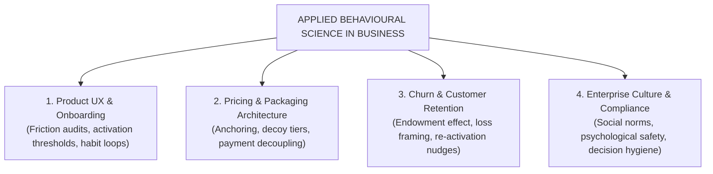
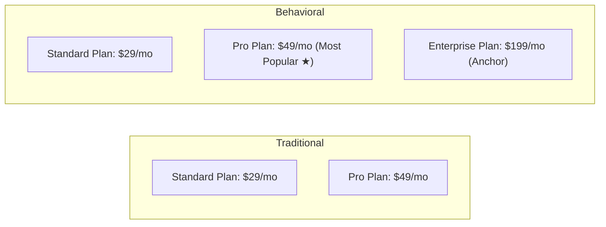
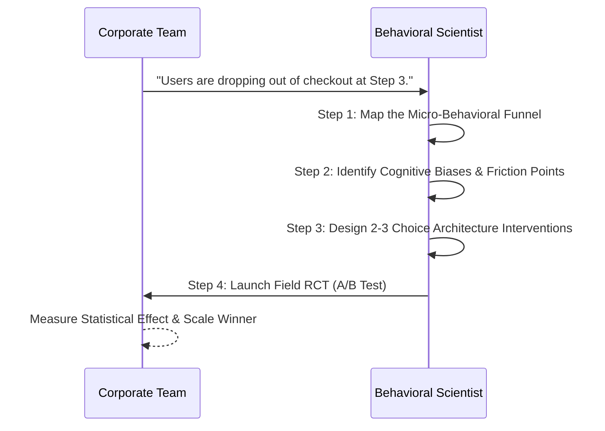

Most business strategies fail not because of poor technology or insufficient capital, but because of a flawed mental model of human behavior.

Traditional management assumes that customers, users, and employees make rational cost-benefit calculations based on complete information. 

Yet in reality, human decisions are governed by **cognitive load**, **immediate emotional salience**, **status quo defaults**, and **social proof**.

When companies replace guesswork with **Applied Behavioural Science**, they systematically eliminate decision friction, unlock customer lifetime value, and build sustainable competitive advantage.

---

## The 4 Core Corporate Pillars of Behavioral Science

### 1. Digital Product UX & User Onboarding
The first 5 minutes of a user’s interaction with a digital product dictate long-term retention. Behavioral design identifies where users drop off across the **Action Line** ($B = MAP$):

* **Friction Elimination:** Removing non-essential form fields during signup to preserve working memory.
* **Progressive Disclosure:** Presenting complex advanced settings only after the user experiences the initial "Aha!" moment.
* **Endowed Progress Effect:** Showing users a profile completion bar that starts at 20% (e.g., *"Profile created +20%"*) dramatically accelerates completion compared to starting at 0%.

### 2. Pricing & Packaging Architecture
Price is never evaluated in a vacuum; it is judged relative to surrounding cognitive anchors:

* **Anchoring & Framing:** Placing a premium enterprise tier ($199/mo) beside a professional plan ($49/mo) establishes a reference point that makes the professional plan feel like an obvious value.
* **The Decoy Effect (Asymmetric Dominance):** Introducing an intentionally dominated third option redirects customer choice toward the higher-margin target tier.
* **Annual Billing Decoupling:** Framing annual pricing as *"Just $19/month (billed annually)"* lowers the perceived immediate pain of paying compared to displaying *"Single payment of $228"*.

### 3. Churn Mitigation & Customer Retention
Customer churn often happens silently due to habit decay rather than active dissatisfaction:

* **Sunk Cost & The Endowment Effect:** Reminding users of what they have already built, configured, or saved inside the platform (*"You have protected 1,420 files with us this year"*) activates loss aversion.
* **Fresh Start Prompts:** Delivering re-engagement emails at natural transition boundaries (e.g., Monday mornings, the start of a new month) achieves 2x higher click-through rates.

### 4. Organizational Decision Hygiene & Compliance
Within enterprise teams, cognitive biases distort capital allocation and project estimation:

* **The Planning Fallacy:** Project teams routinely underestimate delivery timelines by 40%. Introducing **Reference Class Forecasting** (benchmarking against past similar projects) restores empirical realism.
* **Pre-Mortem Analysis:** Before launching an initiative, teams run a structured exercise assuming the project failed catastrophically, forcing members to identify hidden structural risks without fear of seeming unsupportive.

---

## The Behavioral Audit Protocol: A 4-Step Methodology

When behavioral scientists enter an organization to solve a conversion, compliance, or engagement bottleneck, they execute a structured **Behavioral Audit**:

1. **Behavioral Funnel Mapping:** Break down the target action into every discrete physical click, cognitive calculation, and emotional transition.
2. **Barrier & Biases Diagnosis:** Identify whether drop-offs stem from cognitive overload, lack of salience, present bias, or ambiguity aversion.
3. **Intervention Design:** Formulate low-cost, high-leverage choice architecture nudges (using COM-B or EAST).
4. **Field Experimentation (A/B Testing):** Measure the exact conversion lift in a randomized controlled trial against current baseline performance.

---

## How Industry Leaders Structure Behavioral Science Teams

Leading global enterprises (including Google, Spotify, Netflix, Uber, and Lemonade Insurance) integrate behavioral scientists into cross-functional product pods:

| Role / Function | Key Focus Area | Measurable Business Metric |
|---|---|---|
| **Behavioral Product Manager** | Onboarding UX, feature discovery, habit loops | Day-30 User Retention, Activation Rate |
| **Pricing & Revenue Scientist** | Tier framing, decoy design, checkout flow | Average Revenue Per User (ARPU), Cart Abandonment |
| **Growth Behavioral Strategist** | Referral incentives, social proof messaging | Viral Coefficient ($K$-Factor), CAC Reduction |
| **Organizational Decision Architect** | Executive capital allocation, post-mortems | Project Timeline Accuracy, Safety Compliance |

---

## Frequently Asked Questions (FAQ)

### What does an applied behavioral scientist do in a company?
An applied behavioral scientist uses empirical decision science to diagnose why customers, users, or employees fail to take desired actions, and designs choice architecture interventions (nudges, UX tweaks, pricing adjustments) that are validated via A/B testing.

### What is the difference between behavioral science and standard growth marketing?
While growth marketing often relies on rapid, trial-and-error guesswork ("let's test a red button vs. a green button"), behavioral science is grounded in validated psychological mechanisms (cognitive load, loss aversion, social proof), allowing teams to build hypotheses that succeed with higher statistical consistency.

### How do you measure the ROI of behavioral science consulting?
ROI is directly measured through controlled A/B field trials comparing the new behavioral intervention against the baseline control group across core metrics like checkout conversion rate, trial-to-paid conversion, and churn reduction.

---

## Related Master Guides

* **Foundational Science:** [What is Behavioural Science? The Complete Guide](/what-is-behavioural-science/)
* **Intervention Playbook:** [The EAST Framework: 4 Principles for Behavioral Insights](/east-framework-behavioural-insights/)
* **Digital Decision Design:** [Choice Architecture in Digital UX & Pricing](/choice-architecture-principles-ux/)
* **Cognitive Biases:** [Loss Aversion Explained: Why Losses Hurt 2x More](/loss-aversion-bias-examples/)
