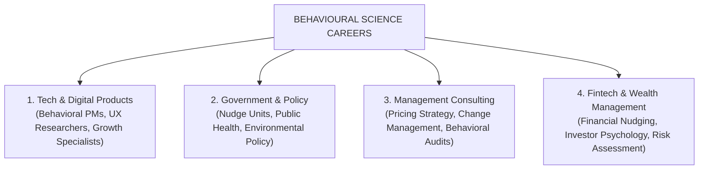
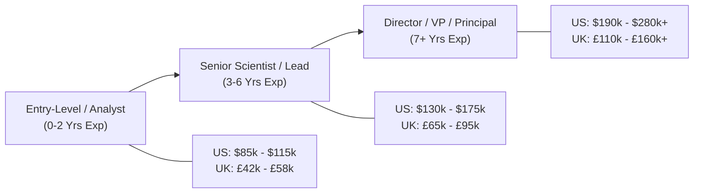
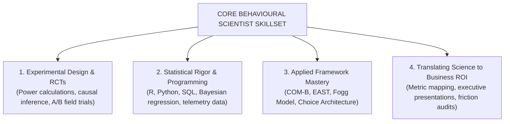
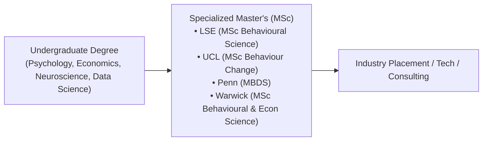

Over the past decade, the demand for professionals who understand human decision-making has grown dramatically. 

What was once an esoteric academic discipline confined to university laboratories is now a core functional competency inside Fortune 500 tech companies, government policy units, management consultancies, and digital health startups.

Whether you are completing a degree in cognitive science, transitioning from traditional UX research, or seeking to establish an in-house behavioral team, this guide breaks down the modern career landscape, compensation benchmarks, and technical requirements.

---

## 4 Dominant Industry Career Tracks

### 1. Technology & Digital Products (Highest Compensation)
Tech companies (including Google, Spotify, Meta, Amazon, and Uber) hire behavioral scientists directly into product and data teams.
* **Key Focus:** User onboarding friction, Day-30 retention, habit loops, push notification timing, and experimentation infrastructure (A/B testing).
* **Common Titles:** *Behavioral Product Manager, Applied Behavioral Scientist, Quantitative UX Researcher, Decision Scientist.*

### 2. Government & Public Policy ("Nudge Units")
Over 200 public policy teams worldwide (such as the UK Behavioural Insights Team, US Office of Evaluation Sciences, and World Bank Mind, Behavior, and Development Unit) deploy behavioral interventions at national scale.
* **Key Focus:** Tax compliance, preventive healthcare adoption, organ donation, energy reduction, and voter participation.
* **Common Titles:** *Behavioral Policy Advisor, Principal Behavioral Analyst, Public Health Behavioral Specialist.*

### 3. Management & Strategy Consulting
Top consulting firms (McKinsey, BCG, Deloitte, and specialized boutiques like The Decision Lab and BEworks) advise enterprise clients on consumer choice and organizational transformation.
* **Key Focus:** Pricing and tier architecture, M&A organizational change management, customer journey friction audits, and sales enablement.
* **Common Titles:** *Behavioral Strategist, Management Consultant (Behavioral Practice), Decision Architect.*

### 4. Fintech & Digital Health
Specialized sectors with extreme behavioral friction (e.g., managing diabetes or saving for retirement) rely heavily on behavioral design.
* **Key Focus:** Auto-savings algorithms, debt payment prioritization, medication adherence, and clinical trial compliance.
* **Common Titles:** *Health Behavior Architect, Fintech Behavioral Strategist.*

---

## Global Salary Benchmarks (US, UK & Europe)

Salaries for behavioral scientists reflect their direct impact on commercial revenue and data-driven product optimization.

| Career Stage / Level | US Total Compensation | UK Total Compensation | European Union (Avg) |
|---|---|---|---|
| **Entry-Level Behavioral Analyst** (0–2 yrs) | \$85,000 – \$115,000 | £42,000 – £58,000 | €48,000 – €65,000 |
| **Applied Behavioral Scientist** (3–5 yrs) | \$130,000 – \$165,000 | £65,000 – £85,000 | €70,000 – €95,000 |
| **Senior / Lead Decision Scientist** (5–8 yrs) | \$165,000 – \$210,000 | £85,000 – £115,000 | €95,000 – €130,000 |
| **Head / Director of Behavioral Science** (8+ yrs) | \$210,000 – \$320,000+ | £120,000 – £180,000+ | €135,000 – €200,000+ |

*Note: Tech equity (RSUs) and performance bonuses in major US tech hubs (SF Bay Area, NYC, Seattle) frequently push senior total compensation above \$350,000.*

---

## The Essential Technical Skillset: What Employers Test

To secure senior roles, candidates must possess a synthesis of behavioral domain expertise, experimental statistics, and business acumen:

1. **Randomized Controlled Trials (RCTs):** Deep understanding of sample size power calculations, pre-registration protocols, and mitigating confounding variables in digital field experiments.
2. **Statistical Analysis & Data Telemetry:** Working proficiency in **R** or **Python** (Pandas, statsmodels), **SQL** for database queries, and regression modeling (logistic, hierarchical linear modeling).
3. **Behavioral Diagnostic Frameworks:** Practical mastery of diagnostic tools like the **COM-B Model**, **The Behaviour Change Wheel**, and **EAST**.
4. **Behavioral Product Audits:** The ability to map complex user journeys, identify cognitive bottlenecks, and write precise design hypotheses.

---

## Academic Pathways: Degrees & Certifications

### Top Global Graduate Programs:
* **London School of Economics (LSE):** *MSc in Behavioural Science*
* **University College London (UCL):** *MSc in Behaviour Change (Centre for Behaviour Change)*
* **University of Pennsylvania (Penn):** *Master of Behavioral and Decision Sciences (MBDS)*
* **University of Warwick:** *MSc in Behavioural and Economic Science*
* **Harvard University:** *Executive Education & Behavioral Insights Programs*

---

## Frequently Asked Questions (FAQ)

### What degree do you need to become a behavioral scientist?
Most applied behavioral scientists hold a Master’s degree (MSc/MBDS) or PhD in Behavioral Science, Cognitive Psychology, Behavioural Economics, or Neuroscience. However, strong candidates with undergraduate degrees in psychology or economics paired with practical A/B testing and data science skills frequently enter the field.

### What is the difference between a UX Researcher and a Behavioral Scientist?
While a traditional UX researcher focuses heavily on qualitative usability testing and user interviews (what users *say* they want), a behavioral scientist focuses on quantitative causal mechanisms, choice architecture, cognitive biases, and randomized controlled field experiments (what users *actually do*).

### What programming languages should a behavioral scientist learn?
The industry standard programming stack for behavioral scientists is **SQL** (for data extraction) and **R** or **Python** (for statistical modeling, causal inference, and data visualization).

---

## Related Master Guides

* **Foundational Science:** [What is Behavioural Science? The Complete Guide](/what-is-behavioural-science/)
* **Academic Comparison:** [Psychology vs. Behavioural Science: The Definitive Comparison](/psychology-vs-behavioural-science/)
* **Corporate Applications:** [Applied Behavioural Science in Business Strategy](/applied-behavioural-science-business/)
* **Diagnostic Models:** [The COM-B Model of Behaviour Change](/com-b-model-behaviour-change/)
