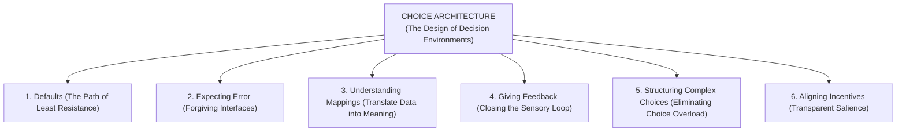
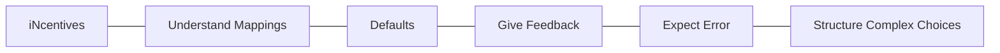
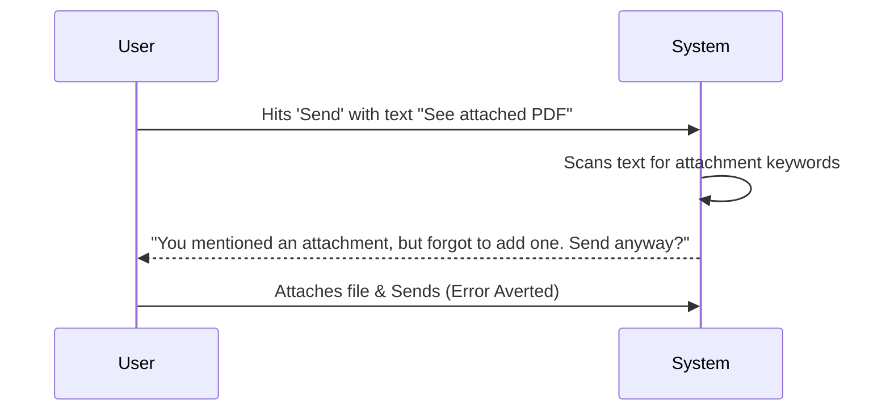
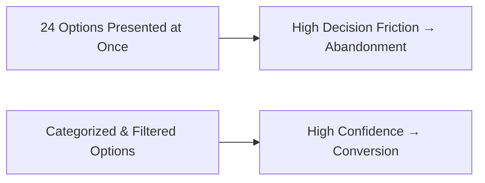

Whenever a user opens an application, lands on a SaaS pricing page, or walks down a grocery store aisle, they enter a **choice environment**. 

The buttons they see, the order of options in a drop-down menu, the default selection, and the font size of price tags are not neutral. Every single detail influences what choices are perceived, evaluated, and ultimately executed.

The deliberate curation of these decision environments is called **Choice Architecture**.

> **The Core Rule of Choice Architecture:**  
> There is no neutral design. The arrangement, sequence, and visual weight of options will always tilt human decision-making. Therefore, choice architects must design consciously and responsibly.

---

## The 6 Core Principles of Choice Architecture

Richard Thaler and Cass Sunstein synthesized the fundamental toolkit of choice architects into the acronym **N-U-D-G-E-S**:

### 1. Defaults (The Single Highest Leverage Tool)
Humans have a profound **status quo bias**. Faced with uncertainty, decision fatigue, or cognitive load, we overwhelmingly accept the pre-selected option.

* **In Product & UX:** Setting the annual billing plan as the default pre-checked radio button, or enabling auto-save in cloud software.
* **In Policy:** Pre-enrolling citizens in organ donation or company retirement schemes.

### 2. Expecting Error (Designing Forgiving Systems)
Human beings are fallible. We get distracted, make typos, and misclick. A well-designed choice architecture anticipates mistake patterns and prevents catastrophic failure.

* **Example:** Gmail’s *"Forgotten Attachment Detector"* scans your email text for words like "attached" or "enclosed" and prompts you with a warning if you hit Send without attaching a file.
* **Example:** ATM machines that force you to remove your bank card *before* dispensing cash, preventing people from walking away and leaving their cards behind.

### 3. Understanding Mappings (Translating Features into Meaning)
Users frequently struggle to map technical specifications to their actual lived experience. A choice architect’s job is to make the relationship between choices and real-world outcomes transparent.

* **Bad Architecture:** Describing digital cameras solely by *"24.2 Megapixels, 1/2.3-inch sensor"*.
* **Good Architecture (Mapping):** *"Produces crisp 8x10 prints and captures vivid low-light photos at family dinners."*
* **In Financial Apps:** Showing not just a \$50/month contribution, but projecting: *"At age 65, this equals \$142,000 in your retirement portfolio."*

### 4. Giving Feedback (Closing the Real-Time Loop)
Decision-makers need immediate, legible feedback to understand when they are performing well or making an error.

* **Example:** Digital progress meters during multi-step checkout that highlight completed vs. pending sections.
* **Example:** Real-time character counts and password entropy meters that turn green as security criteria are met.

### 5. Structuring Complex Choices (Curing the Paradox of Choice)
When presented with too many options (e.g., 24 varieties of jam in Sheena Iyengar’s famous study), people experience **choice overload**. They become paralyzed and walk away without purchasing.

* **Elimination by Aspects:** Providing intuitive multi-attribute filtering (e.g., price range, screen size, operating system).
* **Curated Tiers:** Recommending a *"Most Popular / Best for Teams"* tier on SaaS pricing tables to give users an immediate cognitive anchor.

### 6. Aligning Incentives (Salience of Real Costs)
Incentives only work when they are **visible and salient** at the moment of decision. Often, the true cost of an action is decoupled from its consumption (e.g., swiping a credit card feels painless compared to handing over physical paper cash).

* **Example:** Showing the total monthly electricity bill in real-time on an ambient countertop monitor makes energy consumption emotionally tangible.

---

## Digital Choice Architecture: UX Patterns for High Conversion

| UX Pattern | Behavioral Mechanism | Tactical Implementation |
|---|---|---|
| **Decoy Effect (Asymmetric Dominance)** | Context-Dependent Valuation | Add a higher-priced plan with identical key features to make the middle plan look extraordinarily high-value. |
| **Progressive Disclosure** | Cognitive Load Management | Break a 20-field onboarding form into 3 bite-sized steps with a progress bar. |
| **Anchor Pricing** | Anchoring & Adjustment | Place the enterprise tier (\$299/mo) on the left to make the pro tier (\$49/mo) feel like an accessible bargain. |
| **Social Proof Default** | Informational Conformity | Badge the primary tier with *"Selected by 74% of developers"*. |

---

## Frequently Asked Questions (FAQ)

### What is the definition of choice architecture?
Choice architecture refers to the intentional design of environments in which people make decisions. It encompasses how choices are presented, sequenced, categorized, and defaulted.

### How does choice architecture differ from UX design?
UX design focuses broadly on usability, aesthetics, and user flows. Choice architecture specifically applies behavioral science principles (like heuristics, cognitive biases, and defaults) to guide human decision-making within those interfaces.

### What is choice overload and how do choice architects fix it?
Choice overload occurs when too many options overwhelm a user's working memory, causing decision fatigue and cart abandonment. Choice architects fix this through progressive disclosure, recommended default tiers, and attribute filtering.

---

## Related Master Guides

* **Foundational Science:** [What is Behavioural Science? The Complete Guide](/what-is-behavioural-science/)
* **Nudge Principles:** [Nudge Theory Explained: 12 Real-World Examples](/nudge-theory-examples-principles/)
* **Habit Design:** [The Fogg Behavior Model ($B = MAP$) in Digital Product UX](/fogg-behavior-model-b-map/)
* **Cognitive Biases:** [Loss Aversion Explained: Why Losses Hurt 2x More](/loss-aversion-bias-examples/)
