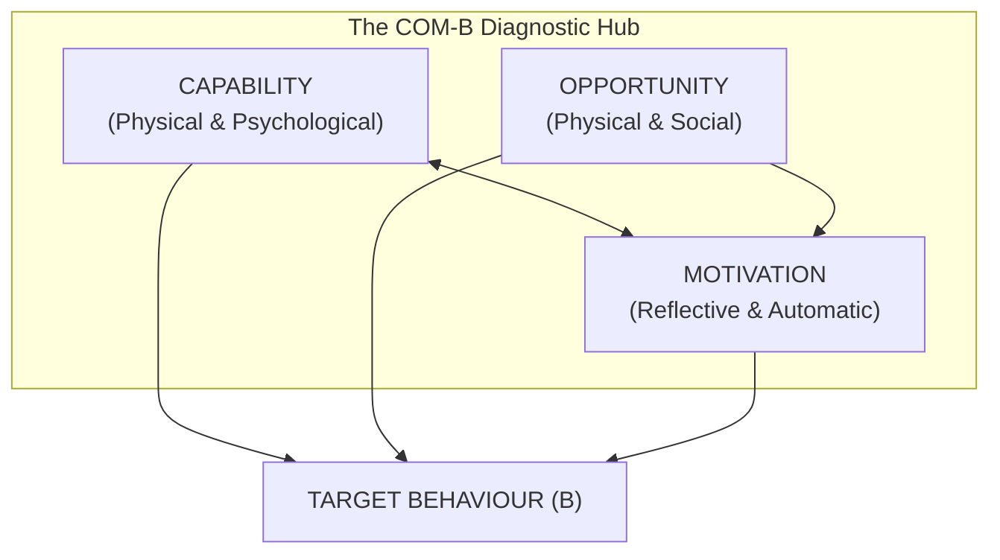
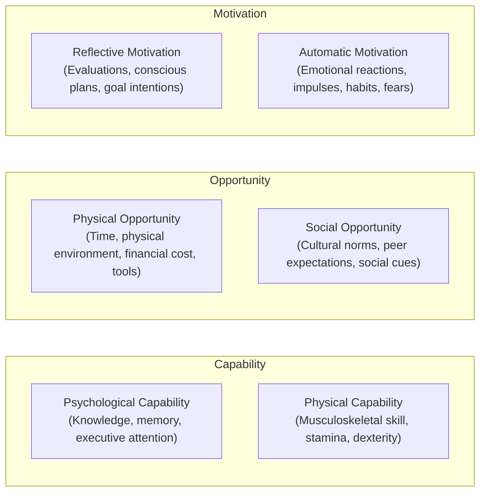
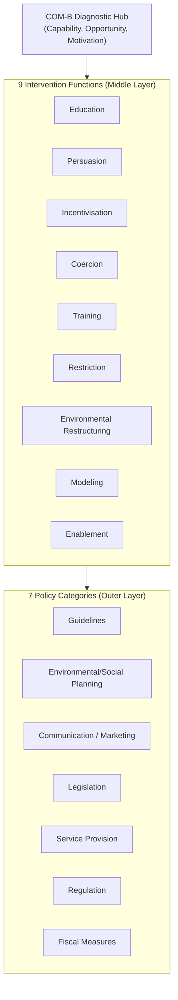

When interventions fail—whether it is an employee failing to adopt a new CRM, a patient neglecting their daily prescription, or a user dropping off mid-onboarding—organizations almost universally misdiagnose the cause as a **lack of motivation**. 

Leaders send motivational memos, product managers add celebratory confetti animations, and clinicians repeat warnings about future health risks. Yet the behavior remains stubbornly unchanged.

In 2011, Professor Susan Michie, Maartje van Stralen, and Robert West at University College London (UCL) published a landmark synthesis of 19 theoretical frameworks of behavior change. Their objective was to build a comprehensive, ecologically valid system for behavioral diagnosis and intervention design.

The result is the **COM-B Model** and the **Behaviour Change Wheel (BCW)**.



---

## What is the COM-B Model?

> **The COM-B Thesis:**  
> A target behavior ($B$) will occur if and only if the individual or group has the **Capability** ($C$) and the **Opportunity** ($O$) to engage in the behavior, and is more **Motivated** ($M$) to perform that behavior than any competing alternative.

The model is dynamic: Capability and Opportunity can influence Motivation, and engaging in the behavior itself provides feedback that reinforces or alters Capability, Opportunity, and Motivation over time.

---

## Deconstructing the 6 Subcomponents of COM-B

To turn COM-B into a rigorous diagnostic instrument, each of the three core pillars is subdivided into two distinct dimensions:



| Component | Sub-Dimension | Operational Definition | Diagnostic Diagnostic Question |
|---|---|---|---|
| **Capability** | **Psychological** | Knowledge, mental processing capacity, executive attention, and comprehension required to execute the behavior. | *Does the individual understand what to do, how to do it, and have the mental bandwidth to execute?* |
| **Capability** | **Physical** | Musculoskeletal stamina, physical strength, manual dexterity, and bodily capacity. | *Does the person have the physical ability and bodily readiness required?* |
| **Opportunity** | **Physical** | Environmental affordances, physical access, time availability, physical proximity, and material resources. | *Does the physical environment provide the necessary tools, time, and friction-free access?* |
| **Opportunity** | **Social** | Cultural norms, institutional expectations, peer group influence, social validation, and language conventions. | *Is this behavior socially acceptable, expected, or reinforced by the individual's community?* |
| **Motivation** | **Reflective** | Conscious, deliberative cognitive processes involving evaluations of pros/cons, goal intentions, and beliefs about capabilities. | *Does the individual consciously believe this behavior is beneficial, necessary, and aligned with their identity?* |
| **Motivation** | **Automatic** | Associative, emotional, and reflex-driven impulses, instinctive appetites, conditioned habits, and acute fears. | *Does the immediate emotional state, habit loop, or associative cue pull the person toward the behavior?* |

---

## The Behaviour Change Wheel: Moving from Diagnosis to Intervention

COM-B is not merely a descriptive model; it forms the diagnostic hub at the center of the **Behaviour Change Wheel (BCW)**. Once you identify which COM-B components are blocking the behavior, the BCW maps them directly to 9 specific **Intervention Functions** and 7 **Policy Categories**.



### The Diagnostic Mapping Matrix

| Diagnosed Barrier (COM-B) | Recommended Intervention Functions | Example Real-World Execution |
|---|---|---|
| **Lack of Psychological Capability** | Education, Training, Enablement | Provide progressive checklist walkthroughs rather than a 50-page PDF manual. |
| **Lack of Physical Opportunity** | Environmental Restructuring, Enablement | Move healthy snacks to eye-level or automate 1-click passwordless login. |
| **Lack of Social Opportunity** | Modeling, Persuasion | Display public testimonials and peer benchmarks (*"84% of your peers completed this step"*). |
| **Lack of Reflective Motivation** | Education, Persuasion, Incentivisation | Quantify the direct financial upside of early retirement contributions. |
| **Lack of Automatic Motivation** | Environmental Restructuring, Incentivisation, Conditioning | Pair an immediate micro-reward with habit completion (e.g., instant sensory feedback). |

---

## A Step-by-Step Diagnostic Protocol for Practitioners

When troubleshooting a behavioral failure in your product, organization, or clinical program, follow this 4-step diagnostic protocol:

```
[1. Define Target Behavior with Extreme Granularity]
                         │
                         ▼
[2. Conduct the COM-B Gap Audit]
                         │
                         ▼
[3. Select Corresponding Intervention Functions]
                         │
                         ▼
[4. Design and Measure the Minimum Viable Intervention (MVI)]
```

### 1. Define the Behavior Verbatim
Avoid vague abstractions like *"increase employee engagement"* or *"eat healthier"*. Specify:
* **Who** must perform the action?
* **What** exact physical or digital action is required?
* **Where** must it take place?
* **When** and how often?

*Example:* "Junior engineers (Who) must submit an architecture review ticket (What) in Jira (Where) within 24 hours of opening a PR (When)."

### 2. Run the Diagnostic Barrier Test
Audit all 6 subcomponents before writing a single line of code or designing an intervention. If an engineer forgets because the form has 14 required fields, it is an **Opportunity (Physical)** and **Capability (Psychological)** failure, not a motivation problem.

---

## Real-World Case Studies

### Case Study 1: Hand Hygiene in Intensive Care Units
* **The Problem:** Hospital staff hand-washing compliance hovered below 55% despite repeated training seminars (Education).
* **COM-B Diagnosis:** 
  * *Capability:* High (staff knew how to wash hands).
  * *Reflective Motivation:* High (staff believed in patient safety).
  * *Physical Opportunity:* **Low** (sanitizer dispensers were located far from patient beds).
  * *Automatic Motivation:* **Low** (cognitive overload during emergencies crowded out the habit loop).
* **Intervention:** Relocated dispensers to the direct physical threshold of every patient room (Environmental Restructuring) and added high-contrast visual cues (Prompts). Compliance surged to 88%.

### Case Study 2: B2B SaaS Onboarding Drop-Off
* **The Problem:** 62% of trial signups never completed database integration.
* **COM-B Diagnosis:** 
  * *Psychological Capability:* **Low** (technical docs assumed advanced API familiarity).
  * *Social Opportunity:* **Low** (no peer validation that setup takes under 3 minutes).
* **Intervention:** Replaced raw documentation with an interactive sandbox terminal and displayed real-time developer testimonials. Activation increased by 34%.

---

## Frequently Asked Questions (FAQ)

### Who developed the COM-B model?
The COM-B model was developed in 2011 by Professor Susan Michie, Dr. Maartje van Stralen, and Professor Robert West at University College London (UCL) as the core diagnostic engine of the Behaviour Change Wheel.

### How does COM-B differ from the EAST framework?
COM-B is a **diagnostic framework** designed to identify the root causes of why a behavior is or is not happening across Capability, Opportunity, and Motivation. EAST is an **intervention design framework** (Easy, Attractive, Social, Timely) optimized for rapidly crafting nudges once the problem is diagnosed.

### Can COM-B be used for organizational change management?
Yes. COM-B is widely utilized in corporate change initiatives to determine whether employee resistance stems from skill gaps (Capability), structural friction (Opportunity), or misaligned incentives (Motivation).

---

## Related Master Guides & Tools

* **Core Overview:** [What is Behavioural Science? The Complete Guide](/what-is-behavioural-science/)
* **Intervention Design:** [The EAST Framework: 4 Principles for Behavioral Insights](/east-framework-behavioural-insights/)
* **Tech & Habits:** [The Fogg Behavior Model ($B = MAP$) in Digital Product UX](/fogg-behavior-model-b-map/)
* **Consulting Applications:** [Applied Behavioural Science in Business Strategy](/applied-behavioural-science-business/)
