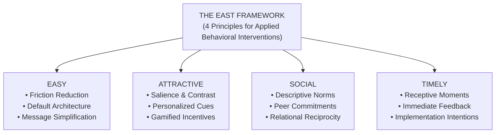
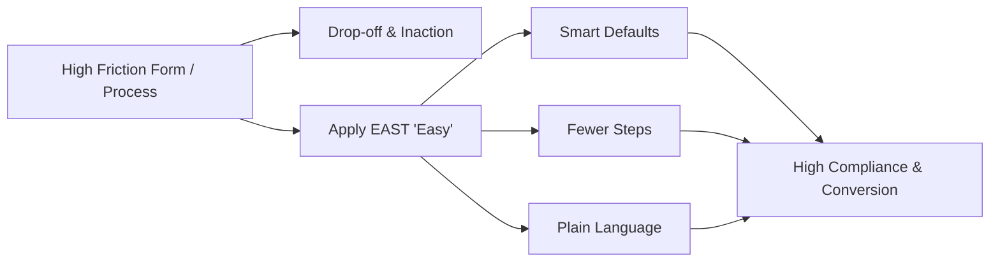
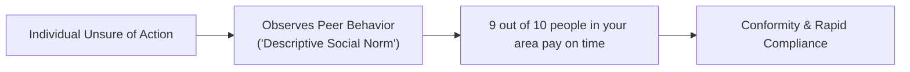

Complex academic theories often falter when brought into fast-paced corporate environments or government policy units. When policymakers and product designers are faced with massive psychological literature, they need an agile, pragmatic framework to craft effective interventions.

In 2012, the **UK Behavioural Insights Team (BIT)**—originally established inside the UK Cabinet Office as the world's first government "Nudge Unit"—published the **EAST Framework**.

> **The Core EAST Premise:**  
> If you want to encourage any target behavior, make it **Easy**, **Attractive**, **Social**, and **Timely**.

---

## Principle 1: Make It EASY

Human cognition is inherently energy-conserving. When faced with unnecessary cognitive or physical friction, System 1 defaults to the path of least resistance: inaction.

### Core Mechanisms of "Easy":
1. **Harness the Power of Defaults:** People overwhelmingly stick with pre-selected options. Making a desired behavior the default (e.g., automatic pension enrollment, paperless billing) produces dramatic behavioral shifts without restricting choice.
2. **Reduce Friction Costs (The "Hassle Factor"):** Every additional form field, click, or cognitive decision decreases completion rates exponentially. Eliminating a single redundant step often outperforms complex promotional campaigns.
3. **Simplify Information:** Replace dense jargon with concise, scannable bullet points and clear calls-to-action.

---

## Principle 2: Make It ATTRACTIVE

We are bombarded with thousands of competing stimuli daily. To trigger behavior, an intervention must break through perceptual habituation and command attention.

### Core Mechanisms of "Attractive":
1. **Salience & Visual Contrast:** Draw attention to what matters most through visual hierarchy, color contrast, and immediate visual anchors.
2. **Personalization:** Tailoring messages with recipient names, local context, or past purchase behavior significantly increases open and response rates.
3. **Designing Rewards & Lotteries:** Small, immediate incentives or lottery-based rewards (e.g., a 1-in-100 chance to win \$500) frequently motivate behavior more cost-effectively than large, delayed lump sums due to human probability weighting.

---

## Principle 3: Make It SOCIAL

Humans are profoundly social primates whose choices are governed by the perceived actions and expectations of their reference group.

### Core Mechanisms of "Social":
1. **Show That Most People Perform the Desired Behavior (Descriptive Norms):** Highlighting positive social compliance motivates others to conform.
2. **Use the Power of Networks:** Leverage peer-to-peer recommendations and reciprocal commitments rather than institutional top-down mandates.
3. **Make Public Commitments:** When individuals state an intention publicly or sign a commitment device in front of peers, cognitive dissonance powerfully drives follow-through.

---

## Principle 4: Make It TIMELY

A brilliant intervention delivered at the wrong moment produces zero return. Human receptivity fluctuates based on temporal landmarks, cognitive bandwidth, and transition periods.

### Core Mechanisms of "Timely":
1. **Prompt When People Are Most Receptive:** Target transitions and "Fresh Start" moments (e.g., moving to a new home, changing jobs, starting a new year).
2. **Consider Immediate vs. Future Costs:** Humans suffer from **present bias**—we overvalue immediate payoffs and heavily discount future consequences. Align immediate rewards with long-term goals.
3. **Prompt Implementation Intentions (If-Then Planning):** Help people bridge the intention-behavior gap by specifying *When*, *Where*, and *How* they will execute the action:
   $$\text{"If situation } X \text{ occurs, then I will perform behavior } Y."$$

---

## The EAST Implementation Matrix

| EAST Pillar | Corporate / B2B Application | Public Policy & Health Application | Digital UX / Product Example |
|---|---|---|---|
| **Easy** | Auto-fill lead forms using email domain lookup. | Automatically register voters when renewing driver’s licenses. | 1-Click Apple Pay checkout bypassing address entry. |
| **Attractive** | Highlight ROI savings in bold visual callout boxes on invoices. | Use personalized letters with bold, handwritten-style payment deadlines. | High-contrast CTA buttons and interactive ROI sliders. |
| **Social** | *"Join 14,000+ engineering teams using our platform."* | *"92% of residents in Bristol pay their council tax on time."* | Live social proof popups showing recent customer signups. |
| **Timely** | Send contract renewal prompts 30 days before fiscal quarter end. | Send flu vaccination appointment SMS reminders at 7:30 AM on Saturdays. | In-app feature prompts delivered immediately after completing a milestone. |

---

## Real-World Case Studies

### 1. The UK Tax Letter Field Experiment
* **The Challenge:** Millions of pounds in overdue tax payments required costly enforcement.
* **EAST Solution:** The Behavioural Insights Team rewrote the standard HMRC collection letter to incorporate a single descriptive social norm sentence:
  > *"9 out of 10 people in the UK pay their tax on time. You are currently in the small minority who have not yet paid."*
* **The Result:** Payment rates increased by **15 percentage points**, accelerating £200+ million into public revenues in a single fiscal year at near-zero marginal cost.

### 2. Reducing Missed Court Appearances
* **The Challenge:** Thousands of citizens failed to appear for court dates due to simple forgetting and confusing summons forms.
* **EAST Solution:** Summons forms were redesigned to make date and location prominent (**Attractive**), and automated SMS reminders were sent 24 hours prior (**Timely**).
* **The Result:** Missed court appearances plummeted by **26%**, preventing thousands of arrest warrants.

---

## Frequently Asked Questions (FAQ)

### What is the EAST framework in behavioral insights?
The EAST framework is a methodology developed by the UK Behavioural Insights Team that organizes behavioral change into four pragmatic principles: Make it Easy, Attractive, Social, and Timely.

### How does EAST differ from Nudge Theory?
Nudge Theory is the broader philosophical and economic foundation (introduced by Thaler and Sunstein). The EAST Framework is an operational checklist designed to apply Nudge Theory quickly and reliably in practice.

### Which EAST principle has the highest impact?
Empirical testing across hundreds of randomized controlled trials shows that **"Make it Easy"** (friction reduction and defaults) consistently produces the largest effect sizes.

---

## Related Master Guides

* **Core Overview:** [What is Behavioural Science? The Complete Guide](/what-is-behavioural-science/)
* **Diagnostic Model:** [The COM-B Model of Behaviour Change](/com-b-model-behaviour-change/)
* **Nudge Principles:** [Nudge Theory Explained: 12 Real-World Examples](/nudge-theory-examples-principles/)
* **Decision UX:** [Choice Architecture in Digital Product Design](/choice-architecture-principles-ux/)
