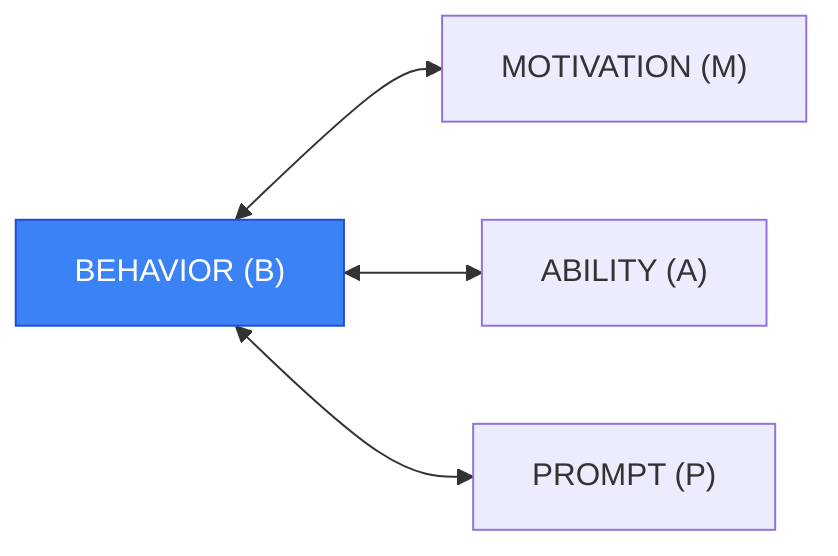
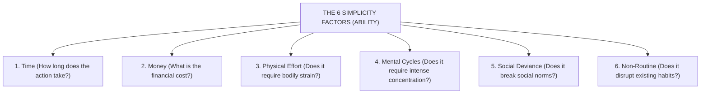
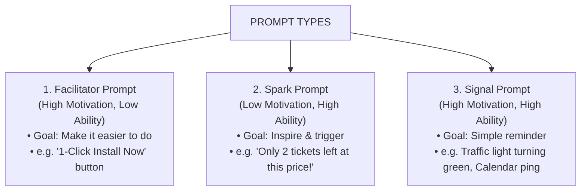

In digital product design, health coaching, and habit formation, teams frequently obsess over **Motivation**. 

They believe that if they can just deliver an inspiring keynote, craft an emotional promotional video, or offer a bigger financial incentive, users will magically complete complex tasks.

Yet Dr. BJ Fogg, founder of the Behavior Design Lab at Stanford University, demonstrated that **motivation is the least reliable driver of human action**. It is volatile, emotionally fleeting, and requires immense mental energy to sustain.

To design predictable behavior, you need the **Fogg Behavior Model (FBM)**.



$$\mathbf{B = MAP}$$

> **The Fundamental Law of Behavior Design:**  
> A behavior ($B$) happens when **Motivation** ($M$), **Ability** ($A$), and a **Prompt** ($P$) converge at the exact same moment. If any of these three elements is missing or insufficient, the behavior will not occur.

---

## The Fogg Behavior Grid & The Action Line

```
High ▲
     │            ★ Behavior Occurs (Success)
     │           /
M    │          /
O    │         /   [ ACTION LINE ]
T    │        /
I    │       /
V    │      /      ✕ Behavior Fails (Frustration / Inaction)
A    │     /
T    │    /
I    │   /
O    │  /
N    │ /
Low  ▼────────────────────────────────────────►
     Hard to Do (Low Ability)      Easy to Do (High Ability)
```

The relationship between Motivation and Ability is a curved threshold called the **Action Line**:

1. **Above the Action Line:** If a prompt triggers the user when their combined Motivation and Ability place them *above* the curved line, the behavior succeeds.
2. **Below the Action Line:** If the prompt arrives when they are *below* the line, the behavior fails—either resulting in annoyance (if prompted when motivation is zero) or frustration (if prompted to do something excessively difficult).

### The First Rule of Behavior Design:
> **Make the behavior easier to do before trying to increase motivation.**

Increasing ability (reducing friction) permanently shifts the user to the right side of the curve, making the behavior reliably triggerable even when motivation is low.

---

## Deconstructing Ability: The 6 Simplicity Factors

Ability is not just about physical strength; it is defined by **Simplicity**. Simplicity is determined by your user’s most scarce resource at that exact moment.



| Factor | Cognitive / Environmental Barrier | Tactical UX / Design Fix |
|---|---|---|
| **1. Time** | Task requires 15 continuous minutes. | Break into 60-second micro-tasks (progressive onboarding). |
| **2. Money** | Requires upfront credit card commitment. | Provide a friction-free, no-credit-card freemium tier. |
| **3. Physical Effort** | Requires walking to another room or typing on mobile. | Enable 1-click biometric authentication (FaceID). |
| **4. Mental Cycles** | User must read a 10-step manual. | Provide pre-configured templates and smart defaults. |
| **5. Social Deviance** | Action makes the user feel awkward among peers. | Normalize the behavior through visible social proof badges. |
| **6. Non-Routine** | Action does not fit into existing workflows. | Anchor the prompt directly inside an existing daily tool (e.g., Slack/email). |

---

## The 3 Types of Prompts (Triggers)

A prompt is the call-to-action that sparks the behavior. Prompts only work when placed above the Action Line. Dr. Fogg identifies three distinct types:



1. **Facilitator Prompts (High Motivation, Low Ability):** The user wants to act but finds it hard. The prompt must simplify the task (e.g., *"Click here to auto-import your contacts in 5 seconds"*).
2. **Spark Prompts (Low Motivation, High Ability):** The task is easy, but the user lacks motivation. The prompt must pair the trigger with an emotional hook, urgency, or reward (e.g., *"Take 3 deep breaths right now to reduce stress"*).
3. **Signal Prompts (High Motivation, High Ability):** The user is motivated and the task is effortless. The prompt serves as a simple cue (e.g., a reminder notification that your Uber has arrived).

---

## Applying B = MAP to Digital Products and Habit Formation

### 1. The Tiny Habits Method
To establish a lasting daily habit, shrink the target behavior until it requires near-zero motivation (high ability), and anchor it to an existing habit prompt:

$$\text{"After I [Existing Anchor Habit], I will [Tiny New Behavior]."}$$

*Example:* *"After I pour my morning coffee (Anchor), I will write one sentence in my journal (Tiny Behavior)."*

### 2. SaaS Onboarding Optimization
* **Common Failure:** Forcing new users to invite 5 colleagues and configure SSO during first login (Low Ability $\rightarrow$ Drop-off).
* **FBM Redesign:** Let the user experience the core product value in 1 click (High Ability), then present a Facilitator prompt to invite team members only after they have completed their first workflow.

---

## Frequently Asked Questions (FAQ)

### What is the formula of the Fogg Behavior Model?
The formula is $B = MAP$, which stands for **Behavior = Motivation $\times$ Ability $\times$ Prompt**. Behavior only occurs when all three elements are present simultaneously.

### Why does BJ Fogg prioritize Ability over Motivation?
Motivation is naturally volatile and depletes quickly. Ability (simplicity) is stable and within the designer's control. Making a task effortless ensures people can execute it even when their motivation fluctuates.

### What is the difference between a Spark prompt and a Facilitator prompt?
A Spark prompt is designed for someone who finds the task easy but lacks motivation (it adds an emotional hook or incentive). A Facilitator prompt is designed for someone who is motivated but finds the task difficult (it removes friction and simplifies the action).

---

## Related Master Guides

* **Foundational Science:** [What is Behavioural Science? The Complete Guide](/what-is-behavioural-science/)
* **Diagnostic Model:** [The COM-B Model of Behaviour Change](/com-b-model-behaviour-change/)
* **Intervention Principles:** [The EAST Framework for Behavioral Insights](/east-framework-behavioural-insights/)
* **Decision Environments:** [Choice Architecture in Digital Product Design](/choice-architecture-principles-ux/)
