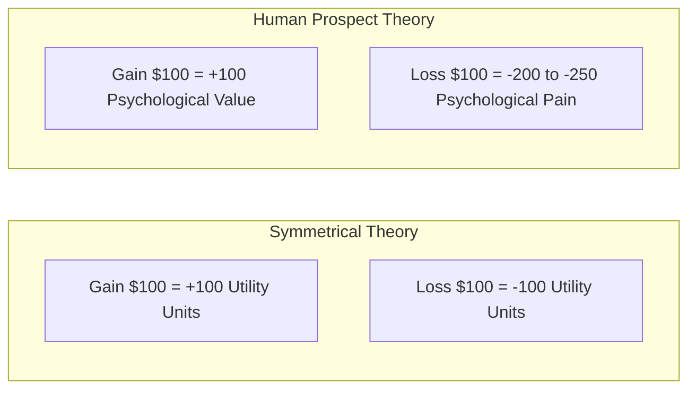
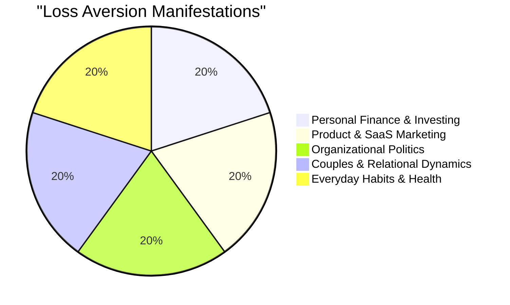
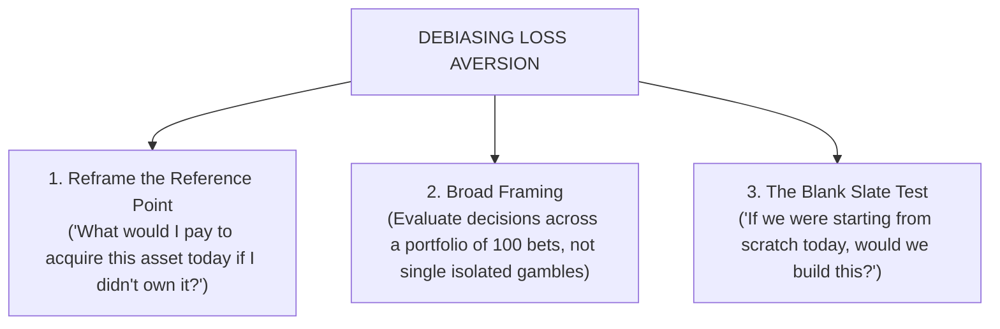

If you found a \$100 bill on the sidewalk this morning, you would experience a pleasant surge of satisfaction. 

However, if you reached into your pocket an hour later and realized you had lost a \$100 bill through a hole in your jacket, your emotional distress would far outweigh the joy of finding the first one.

Mathematically, your net net financial position is \$0. Psychologically, you feel significantly worse off.

This universal human phenomenon is called **Loss Aversion**.



> **The Loss Aversion Principle:**  
> In human cognitive architecture, the pain of losing something is psychologically twice as powerful as the pleasure of gaining the equivalent amount.

---

## The Origins: Kahneman, Tversky & Prospect Theory

In 1979, psychologists Daniel Kahneman and Amos Tversky published their seminal paper on **Prospect Theory**, which dismantled classical expected utility theory and earned Kahneman the 2002 Nobel Prize in Economic Sciences.

Through hundreds of empirical choice experiments, Kahneman and Tversky mapped the **Subjective Value Function**:

```
Subjective Value ▲
                 │                / (Gains)
                 │               /
                 │              /
─── Losses ──────┼─────────────/────────────────► Objective Value
        \        │
         \       │
          \      │
           \     │
            \    │
                 ▼
```

### Key Mathematical Characteristics:
1. **Reference Dependence:** People evaluate outcomes not in terms of absolute wealth, but as gains and losses relative to a neutral **reference point**.
2. **Diminishing Sensitivity:** The difference between gaining \$10 and \$20 feels much larger than the difference between gaining \$1,010 and \$1,020.
3. **Loss Asymmetry (The 2:1 Ratio):** The slope of the value function is significantly steeper in the negative domain than in the positive domain. Empirical research shows the loss aversion coefficient ($\lambda$) typically sits between **$1.8$ and $2.5$**.

---

## 6 Everyday Domains Where Loss Aversion Controls Human Behavior



### 1. The Endowment Effect (Overvaluing What We Own)
Once we take ownership of an object, software workspace, or idea, our reference point shifts. Giving it up is coded by the brain as a painful loss. In Richard Thaler's classic mug experiment, university students who were given a coffee mug refused to sell it for less than \$7.12, while students without a mug were only willing to pay \$2.87 to buy it.

### 2. Free-Trial Conversions in Digital Products
When a user spends 14 days configuring a SaaS platform, customizing their dashboard, and integrating data, the software ceases to be a prospective purchase—it becomes part of their operational endowment. Upgrading to a paid plan is no longer evaluated as *"buying a tool"*, but as *"preventing the loss of our configured workspace"*.

### 3. Investor Disposition Effect (Holding Losers Too Long)
Retail stock investors routinely sell winning stocks too early (to lock in gains) and hold plummeting losing stocks for months or years. Selling at a loss crystallizes the psychological pain into reality, so investors take irrational risks in the desperate hope of breaking even.

### 4. Sunk Cost Fallacy
Because abandoning an failing project, broken vehicle, or bad investment requires accepting a permanent loss, humans irrationally pour additional time, capital, and emotional energy into hopeless endeavors just to avoid writing off past expenditures.

### 5. Relational Conflict & Couples Dynamics
In intimate partnerships, loss aversion operates with acute intensity. During disagreements, partners evaluate perceived losses (loss of autonomy, loss of validation, loss of status) at 2x the psychological weight of potential collaborative gains. 

When a partner feels emotionally threatened, System 1 activates defensive withdrawal or aggressive counter-attacks to prevent the perceived loss of self-worth.

### 6. The Status Quo Bias in Policy & Workplaces
Because the disadvantages of leaving the status quo are coded as losses and loom larger than the prospective advantages (gains), employees and citizens resist even overwhelmingly beneficial reforms.

---

## How to Mitigate Loss Aversion in Decision-Making

When making high-stakes strategic decisions, use these 3 cognitive debiasing tools:



1. **Broad Framing:** Instead of treating each decision as an isolated, make-or-break bet, evaluate it as part of an ongoing bundle of 50 to 100 probabilistic decisions. Over a long horizon, expected positive value will prevail.
2. **The Clean Slate Test (Zero-Based Thinking):** Ask: *"If we did not currently operate this business unit or own this stock, would we invest our capital into it today?"* If the answer is no, the only reason you are keeping it is loss aversion.
3. **Pre-Commitment Exit Rules:** Establish clear quantitative stop-loss rules before entering an investment or project, preventing emotional System 1 panic during downturns.

---

## Frequently Asked Questions (FAQ)

### What is the simple definition of loss aversion?
Loss aversion is a cognitive bias in which people experience the pain of losing something roughly twice as intensely as the pleasure of gaining the exact same thing.

### Who discovered loss aversion?
Loss aversion was mathematically formalized by psychologists Daniel Kahneman and Amos Tversky in their 1979 development of **Prospect Theory**.

### What is the loss aversion coefficient?
The loss aversion coefficient ($\lambda$) is the numerical ratio measuring how much more painful a loss is compared to an equal gain. In most empirical experiments, $\lambda$ ranges between $1.8$ and $2.5$ (meaning a loss hurts approximately $2\times$ more than a gain).

---

## Related Master Guides

* **Foundational Science:** [What is Behavioural Science? The Complete Guide](/what-is-behavioural-science/)
* **Decision UX:** [Choice Architecture in Digital Product Design](/choice-architecture-principles-ux/)
* **Nudge Principles:** [Nudge Theory Explained: 12 Real-World Examples](/nudge-theory-examples-principles/)
* **Discipline Comparison:** [Psychology vs. Behavioural Science: The Definitive Comparison](/psychology-vs-behavioural-science/)
