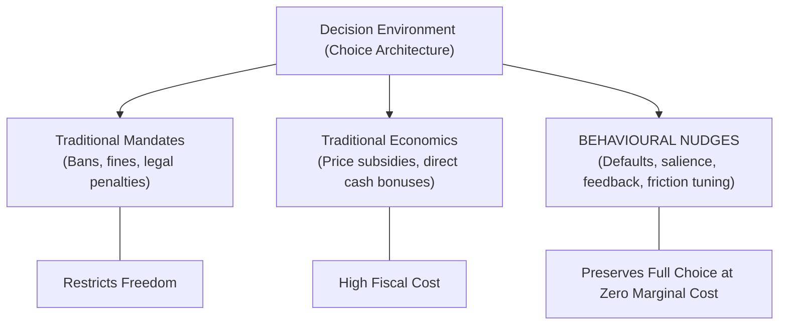
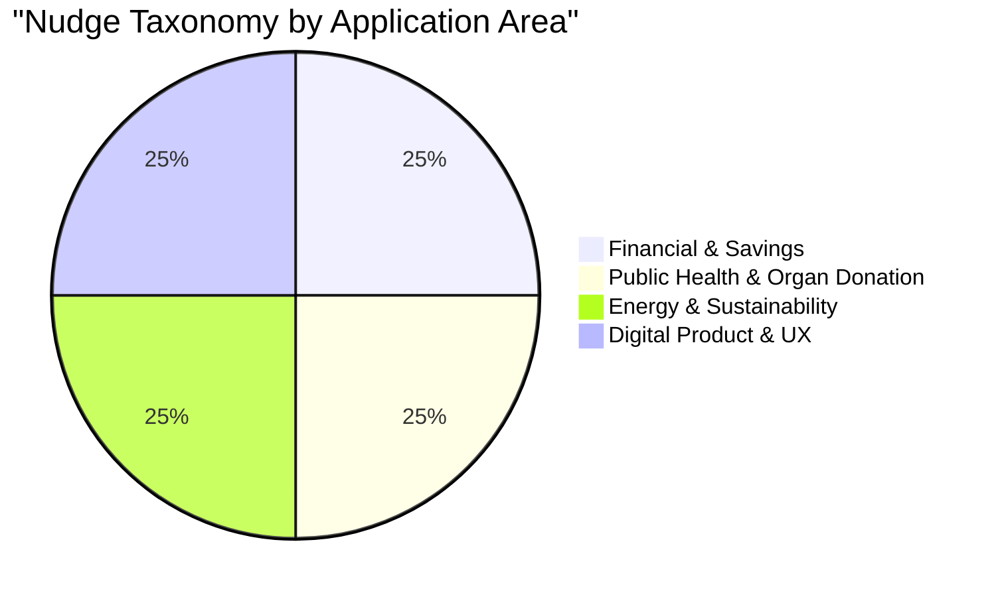
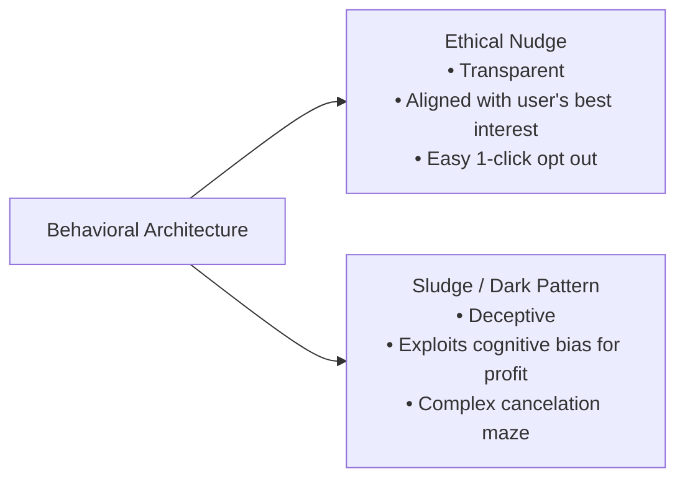

In 2008, economist Richard H. Thaler and legal scholar Cass R. Sunstein published *Nudge: Improving Decisions About Health, Wealth, and Happiness*. The book sparked an international revolution in public policy, product design, and behavioral economics, culminating in Thaler being awarded the **Nobel Memorial Prize in Economic Sciences in 2017**.

At the heart of the concept is a profound observation about human cognition:

> **The Nudge Thesis:**  
> A **nudge** is any aspect of the choice architecture that alters people's behavior in a predictable way **without forbidding any options or significantly changing their economic incentives**. To count as a mere nudge, the intervention must be easy and cheap to avoid.

---

## The Philosophy: Libertarian Paternalism

Thaler and Sunstein coined the term **Libertarian Paternalism** to resolve the tension between autonomy and guidance:

* **Libertarian (Freedom of Choice):** People should be free to do what they like and opt out of undesirable arrangements.
* **Paternalism (Legitimate Influence):** It is legitimate for choice architects to design environments that make people's lives longer, healthier, and better.

The fundamental insight is that **there is no such thing as a "neutral" design**. A cafeteria must place food in some physical order. A software form must have some field pre-selected. A retirement plan must either require an opt-in or an opt-out. Since an architecture *must* exist, designing it to support human wellbeing is both rational and necessary.

---

## 12 Classic & Modern Real-World Examples of Nudges

### 1. The Fly in the Schiphol Airport Urinals (Visual Salience)
* **The Context:** Amsterdam’s Schiphol Airport faced high cleaning costs due to urinal spillage.
* **The Nudge:** In the early 1990s, Aad Kieboom etched the realistic silhouette of a housefly into the porcelain of each urinal directly above the drain.
* **The Result:** Men naturally aimed at the fly, reducing spillage by **80%** and cleaning costs by **8%**.

### 2. Auto-Enrollment in Retirement Plans (Save More Tomorrow)
* **The Context:** Millions of employees fail to enroll in 401(k) retirement plans despite company-matching funds due to status quo bias and decision procrastination.
* **The Nudge:** Companies changed the default from "Opt-In" (active signup required) to "Opt-Out" (automatically enrolled at 3% contribution unless you check a box to cancel).
* **The Result:** Participation rates skyrocketed from **49% to 86%** immediately.

### 3. Presumed Consent for Organ Donation (Default Architecture)
* **The Context:** Countries requiring explicit registration for organ donation (like Germany or the US) hover between 12% and 28% donor consent.
* **The Nudge:** Countries like Austria, Spain, and Belgium adopted presumed consent (everyone is a donor unless they explicitly register an objection).
* **The Result:** Austria achieved **99.98%** donor consent compared to Germany's **12%**, despite sharing similar cultural demographics.

### 4. Opower Social Energy Bills (Descriptive Social Norms)
* **The Context:** Utilities wanted to reduce residential power consumption without heavy subsidies.
* **The Nudge:** Opower added a simple graphic to monthly bills showing each homeowner’s consumption compared to their "Efficient Neighbors" alongside happy/sad smiley faces.
* **The Result:** Energy usage dropped by **2% to 3%** across millions of homes, saving billions of kilowatt-hours.

### 5. Smaller Plates in Hotel Buffets (Sensory Framing)
* **The Context:** Hotel buffets generated tons of plate waste daily.
* **The Nudge:** Reducing plate diameter by just 2 inches made standard portions look abundant (the Delboeuf illusion).
* **The Result:** Food waste decreased by **22%** with zero decline in guest satisfaction.

### 6. Hospital Prescription Default Units (Error Prevention)
* **The Context:** Doctors writing handwritten or free-text digital prescriptions occasionally overdosed patients by orders of magnitude.
* **The Nudge:** Hospital EHR software pre-populated standard dosage ranges and required explicit double-confirmation for outliers.
* **The Result:** Medication dosage errors dropped by over **50%**.

### 7. SaaS Free-Trial Billing Reminders (Trust-Building Nudge)
* **The Context:** Subscription companies historically concealed renewal dates to trap forgetful users.
* **The Nudge:** Modern ethical SaaS platforms send automated reminders 3 days before a trial converts to paid.
* **The Result:** While short-term cancellation rose slightly, long-term customer lifetime value (LTV) and brand advocacy increased by **40%**.

### 8. Lake Shore Drive Visual Speed Chevrons (Perceptual Speed Illusion)
* **The Context:** A dangerous curve on Chicago’s Lake Shore Drive caused frequent rollover accidents.
* **The Nudge:** White lines were painted on the road with spacing that grew progressively closer together as drivers entered the curve.
* **The Result:** Drivers felt they were accelerating even when maintaining speed, naturally tapping their brakes and reducing crashes by **36%**.

### 9. Hotel Towel Reuse: The Power of Specific Norms
* **The Context:** Hotels sought to reduce laundry water usage.
* **The Nudge:** Changing bathroom cards from *"Help save the environment"* to *"75% of guests who stayed in this exact room reused their towels"* (Goldstein, Cialdini, & Griskevicius).
* **The Result:** Towel reuse jumped by **33%**.

### 10. Digital Form Password Strength Feedback (Real-Time Feedback)
* **The Context:** Users consistently choose weak passwords (`123456`, `password`).
* **The Nudge:** Real-time color-coded progress bars that shift from red to green as complexity criteria are satisfied.
* **The Result:** Significantly higher password entropy across consumer applications.

### 11. Prompts for Charitable Giving at ATM Terminals
* **The Context:** Non-profits wanted low-friction micro-donation channels.
* **The Nudge:** ATM screens presented a single prompt at the end of cash withdrawals: *"Would you like to round up your withdrawal by £1 to support local children’s hospitals?"*
* **The Result:** Generated millions in micro-donations with over 15% user acceptance.

### 12. Smart Thermostat Eco-Leaves (Gamified Micro-Rewards)
* **The Context:** Homeowners set temperatures too high in winter and too low in summer.
* **The Nudge:** The Nest thermostat displays a green leaf icon whenever energy-saving temperatures are selected.
* **The Result:** The simple visual symbol prompted millions of hours of voluntary temperature modulation.

---

## The Dark Side: Nudges vs. "Sludge" and Dark Patterns

When behavioral insights are deployed against the user's best interest—such as making subscription cancellation require a 20-minute phone call during business hours—it ceases to be a nudge. Cass Sunstein terms this **"Sludge"**.

### The 3 Golden Rules of Ethical Nudging:
1. **Transparency:** All nudges should be transparent and never misleading.
2. **Easy Opt-Out:** It should be as easy to opt out of the nudge as it was to opt in (1-click parity).
3. **Welfare Alignment:** There should be strong reason to believe the encouraged behavior will improve the welfare of the person being nudged.

---

## Frequently Asked Questions (FAQ)

### What is the definition of a nudge in economics?
A nudge is an intervention that changes the presentation of choices in order to alter behavior predictably, without forbidding any choices or significantly altering economic incentives (e.g., without imposing taxes or bans).

### Who invented Nudge Theory?
Nudge Theory was formulated by behavioral economist Richard Thaler and legal scholar Cass Sunstein in their 2008 book *Nudge*. Thaler received the 2017 Nobel Prize in Economics for his contributions to behavioral economics.

### What is the difference between a nudge and a mandate?
A mandate uses legal compulsion, bans, or fines to force compliance (e.g., a law making seatbelts mandatory under threat of a \$100 ticket). A nudge preserves complete freedom of choice (e.g., an audible seatbelt chime that alerts the driver without preventing the car from moving).

---

## Related Master Guides

* **Foundational Science:** [What is Behavioural Science? The Complete Guide](/what-is-behavioural-science/)
* **Implementation Principles:** [The EAST Framework for Behavioral Insights](/east-framework-behavioural-insights/)
* **Product Architecture:** [Choice Architecture in Digital UX & Decision Design](/choice-architecture-principles-ux/)
* **Cognitive Biases:** [Loss Aversion Explained: Why Losses Hurt 2x More](/loss-aversion-bias-examples/)
