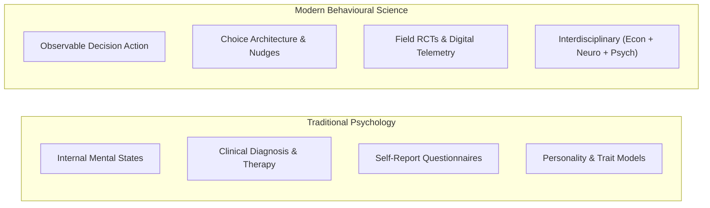
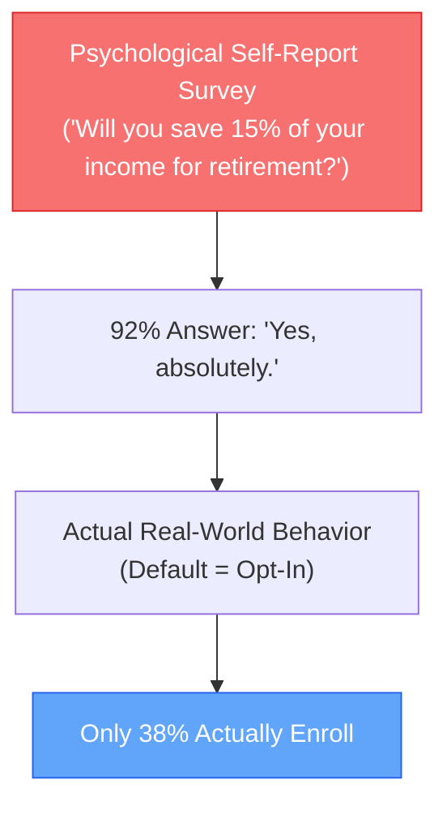
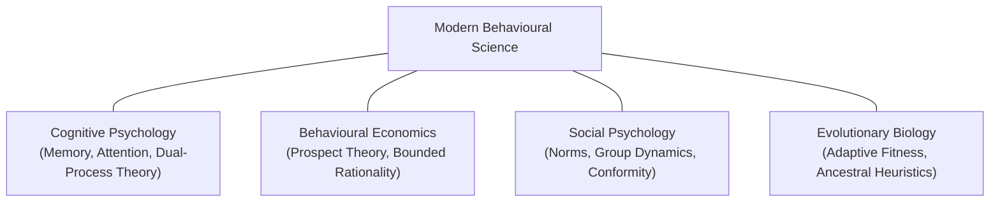
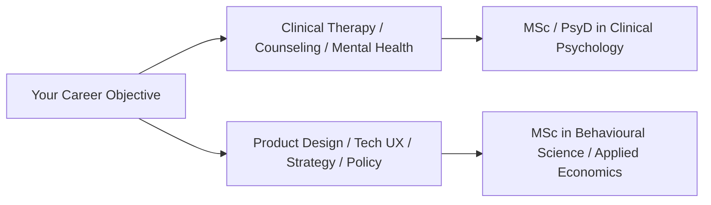

Students, researchers, and enterprise leaders frequently ask a fundamental question:

> **"What is the actual difference between Psychology and Behavioural Science?"**

While the two terms are often used interchangeably in casual conversation, they represent distinct academic lineages, methodological philosophies, and practical applications.

Understanding this distinction is critical whether you are deciding on a university degree, hiring a behavioral specialist for your team, or designing an organizational intervention.

---

## The Core Distinction: Internal States vs. Observable Choice Mechanisms

The primary divergence between the two fields lies in **what they choose to measure and optimize**:

* **Traditional Psychology** focuses primarily on the **internal mind**—exploring subjective conscious experience, emotional states, cognitive development, personality traits, and psychopathology.
* **Behavioural Science** focuses on the **choice mechanics and environmental contexts that produce observable human action**. It treats decision-making as an emergent property of cognitive architecture interacting with external choice architecture.

---

## Direct Comparison Matrix

| Dimension | Traditional Psychology | Modern Behavioural Science |
|---|---|---|
| **Primary Unit of Analysis** | Internal subjective states, personality traits, clinical symptoms, and individual cognitive development. | Observable decisions, behavioral patterns, default adoption, and systemic choice outcomes. |
| **Foundational Lineage** | Clinical psychology, psychoanalysis, cognitive psychology, and psychometrics. | Cognitive psychology, behavioural economics, evolutionary biology, and neuroscience. |
| **Primary Methodologies** | Psychometric surveys, structured clinical interviews, self-report Likert scales, and controlled lab tasks. | Randomized Controlled Trials (A/B testing), field experiments, in-situ telemetry, and behavioral audits. |
| **View of Rationality** | Focuses on individual differences in cognitive capacity, emotional regulation, and mental health. | Focuses on predictable, systematic cognitive biases and bounded rationality shared across all humans. |
| **Primary Output** | Clinical treatment plans, diagnostic formulations (DSM/ICD), and psychological assessments. | Nudge interventions, choice architecture redesigns, behavior change wheels, and policy frameworks. |
| **Typical Career Paths** | Clinical Psychologist, School Counselor, Psychotherapist, HR Specialist. | Behavioral Scientist, Product Manager, Decision Architect, Policy Advisor, UX Strategist. |

---

## The Methodological Divergence: The Self-Report Paradox

A foundational reason for the emergence of behavioural science as a distinct field was the **Intention-Behavior Gap** and the limitations of self-report data.

In traditional survey psychology, researchers ask people what they believe, what they value, and what they intend to do. 

However, behavioral scientists recognize that human self-reports are notoriously distorted by **social desirability bias**, **introspection illusion**, and **present bias**. 

Behavioural science insists on measuring **revealed preferences** (what people actually do with their clicks, wallets, and physical actions in the wild) rather than **stated preferences** (what they say they would do on a Likert scale).

---

## Disciplinary Intersections: Where the Fields Overlap

Behavioural science does not reject psychology; rather, it **synthesizes cognitive and social psychology with economics and biology**:

1. **Cognitive Psychology is the Engine:** Principles like working memory limits, dual-process theory (System 1 vs. System 2), and associative priming come directly from cognitive psychology.
2. **Behavioural Economics is the Translation Layer:** Economics provides the formal mathematical language of utility, incentives, and risk modeling.
3. **Evolutionary Biology provides the Ultimate Cause:** Why do humans fear losses twice as much as they value gains? Evolutionary biology explains that in an ancestral environment of scarcity, a loss could mean starvation or death, while a gain was merely incremental.

---

## Degree and Career Evaluation: Which Pathway Fits Your Goals?

### Choose Psychology If:
* You want to become a licensed clinical psychotherapist, counselor, or mental health clinician.
* You are deeply fascinated by developmental psychopathology, personality theory, and individual diagnostic assessment.
* You wish to conduct laboratory research on perception, emotion, and neurodevelopmental disorders.

### Choose Behavioural Science If:
* You want to work in digital tech companies, fintech, or SaaS shaping user engagement, product onboarding, and UX decision architecture.
* You want to join government "Nudge Units" or international organizations (e.g., UN, World Bank, OECD) designing evidence-based public policies.
* You want to work in management consulting, behavioral marketing, and corporate strategy optimizing pricing, compliance, and organizational culture.

---

## Frequently Asked Questions (FAQ)

### Is psychology considered a behavioral science?
Yes. Broadly defined, psychology is one of the foundational disciplines within the behavioral sciences, alongside behavioural economics, neuroscience, and anthropology. However, "Behavioural Science" as a specialized modern discipline focuses specifically on decision architecture and observable action in applied environments.

### Can a psychologist work as a behavioral scientist?
Yes. Many behavioral scientists begin their careers with foundational degrees in cognitive or social psychology and later specialize in behavioral economics, field experimentation (A/B testing), and choice architecture.

### What is the salary difference between a psychologist and a behavioral scientist?
While clinical psychologists average between \$80,000 and \$110,000 annually, applied behavioral scientists in tech, management consulting, and fintech frequently command salaries between **\$120,000 and \$210,000+** due to their direct impact on commercial metrics and product revenue.

---

## Related Master Guides

* **Foundational Science:** [What is Behavioural Science? The Complete Guide](/what-is-behavioural-science/)
* **Career Blueprint:** [Behavioural Science Careers, Roles & Salary Guide](/behavioural-science-jobs-careers-salary/)
* **Intervention Design:** [The COM-B Model of Behaviour Change](/com-b-model-behaviour-change/)
* **Enterprise Applications:** [Applied Behavioural Science in Business Strategy](/applied-behavioural-science-business/)
