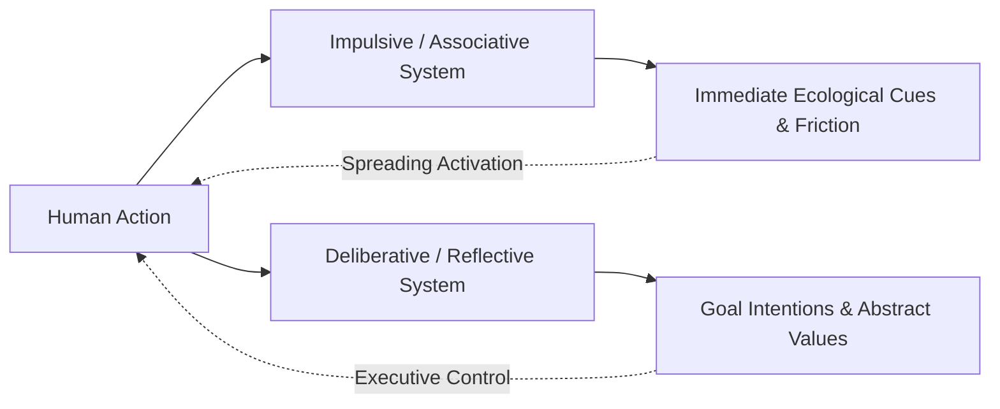
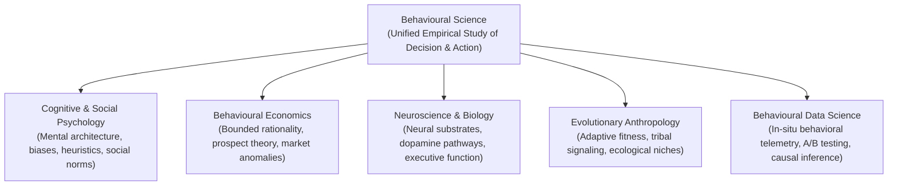
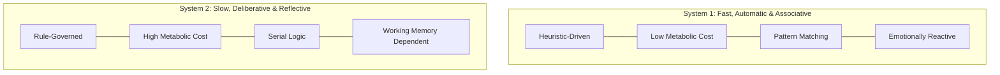
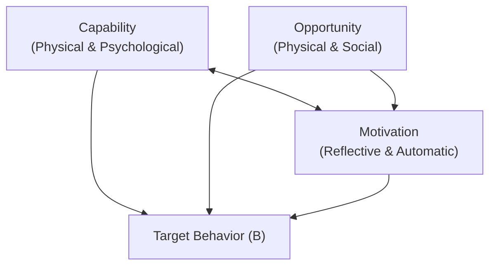
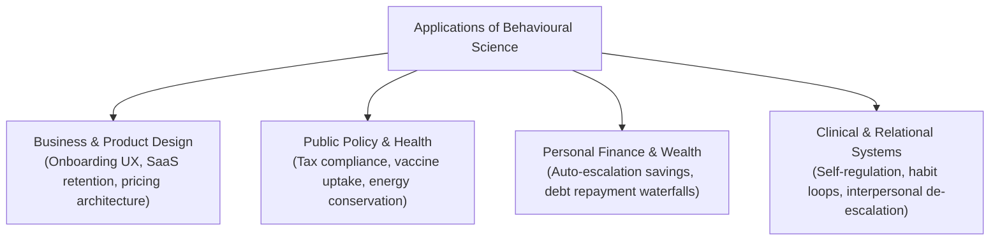

Human beings rarely act according to the pristine axioms of classical economics. We plan to save for retirement, eat clean, and sleep eight hours, yet find ourselves doomscrolling at 2:00 AM while bingeing processed sugar and postponing our pensions.

For over a century, traditional social sciences viewed these behaviors through polarized lenses: either as idiosyncratic moral failures of willpower (traditional individual psychology) or as aggregate mathematical anomalies in rational utility maximization (classical neoclassical economics). 

**Behavioural science** emerged to dissolve this false dichotomy. 



By grounding human action in **evolutionary biology**, **cognitive neuroscience**, and **empirical experimentation**, behavioural science investigates the precise mechanisms that govern how people actually perceive, decide, and act in complex, resource-constrained environments.

---

## Defining Behavioural Science: Scope, Purpose, and Foundations

> **Operational Definition:**  
> **Behavioural science** is an interdisciplinary, empirical field that investigates the cognitive mechanisms, contextual triggers, and social dynamics driving human (and animal) decision-making and action through controlled experimentation, field trials, and observational research.

Unlike abstract philosophical inquiry into free will or purely descriptive social theory, behavioural science demands **operationalization** and **falsification**. It seeks to identify the proximate cognitive triggers (e.g., choice defaults, cognitive load, salience) and ultimate evolutionary functions (e.g., risk aversion, social status signaling, energy conservation) that shape human choices.

### The Interdisciplinary Spectrum

Behavioural science is not a single, isolated discipline. It is a multi-method synthesis of several core fields:



| Discipline | Primary Focus | Methodological Paradigm | Core Question |
|---|---|---|---|
| **Cognitive Psychology** | Mental processing, memory, perception, attention | Laboratory experiments, reaction-time tasks (e.g., Stroop) | *How does information flow through human cognitive architecture?* |
| **Behavioural Economics** | Systematic deviations from rational choice theory | Controlled economic games, field experiments, lottery choices | *Why do humans systematically violate expected utility theory?* |
| **Social Psychology** | Group dynamics, conformity, social norms, attribution | Observational studies, natural field experiments | *How does the perceived presence of others alter individual choice?* |
| **Neuroscience** | Neural substrates of reward, valuation, and executive control | fMRI, EEG, neurochemical tracking | *What biological mechanisms mediate subjective value and impulse control?* |
| **Evolutionary Biology** | Adaptive origins of behavioral schemata | Comparative cross-species analysis, evolutionary modeling | *What ancestral selection pressures forged these cognitive heuristics?* |

---

## Behavioural Science vs. Social Science vs. Traditional Psychology

A common point of confusion is how behavioural science relates to traditional academic classifications. 

```
                                  HUMAN INQUIRY
                                        │
        ┌───────────────────────────────┴───────────────────────────────┐
        ▼                                                               ▼
  SOCIAL SCIENCES                                              BEHAVIOURAL SCIENCES
(Sociology, Political Science,                               (Cognitive Psych, Behavioural Econ,
  Macroeconomics, History)                                      Neuroscience, Decision Science)
        │                                                               │
Focus: Abstract macro-structures,                             Focus: Micro-level causal mechanisms,
societal institutions, historical trends                       individual/group choice, verifiable experiments
```

### 1. Behavioural Science vs. Traditional Psychology
While traditional psychology often focuses on clinical diagnosis, personality traits, and internal subjective states through self-report scales, behavioural science is rigorously centered on **observable, measurable actions and decisions**. It prioritizes verifiable behavioural outcomes—such as click-throughs, medication compliance, default enrollment, and financial decisions—over self-reported intentions.

### 2. Behavioural Science vs. Social Sciences
Disciplines like sociology and political science examine broad social institutions, cultural systems, and macroeconomic structures. In contrast, behavioural science decomposes these phenomena into the **micro-foundations of individual and group decision dynamics**, investigating how specific environmental architectures influence individual actors.

---

## The Dual-Process Architecture: How the Mind Decides

At the theoretical core of modern behavioural science lies the **dual-process framework** of human cognition (popularized by Daniel Kahneman and Amos Tversky, and grounded in decades of cognitive neuroscience):



1. **System 1 (Automatic / Impulsive):** Operates effortlessly, fast, without conscious deliberation or voluntary control. It relies on associative pattern recognition, emotional heuristics, and evolved survival reflexes (e.g., ducking when a shadow darts toward you, reading large billboards automatically, judging facial cues).
2. **System 2 (Reflective / Deliberative):** Allocates attention to effortful mental operations, complex computations, long-term planning, and formal deductive logic. It is resource-intensive and rapidly susceptible to **cognitive depletion and load**.

Because the brain consumes approximately 20% of the body's metabolic energy despite representing only 2% of its mass, human cognitive architecture evolved to be **cognitive misers**. System 1 is the default operational state; System 2 is summoned only when friction, surprise, or focused intention explicitly demands working memory.

---

## The 4 Foundational Frameworks of Applied Behavioural Science

Over the last two decades, academic behavioural science has synthesized into pragmatic, actionable frameworks used by governments, tech companies, and clinical practitioners.

### 1. The COM-B Model & The Behaviour Change Wheel
Developed by Professor Susan Michie and colleagues at University College London (UCL), the **COM-B model** asserts that for any targeted behavior ($B$) to occur, an individual must possess the **Capability**, **Opportunity**, and **Motivation**:



* **Capability:** Does the person have the psychological knowledge and physical skill to act?
* **Opportunity:** Does the physical environment and social culture permit or prompt the action?
* **Motivation:** Are both conscious reflective plans and automatic emotional impulses aligned toward the action?

### 2. The EAST Framework (Behavioural Insights Team)
Formulated by the UK Government's Behavioural Insights Team ("The Nudge Unit"), EAST translates behavioural science into four operational maxims:

* **Easy:** Reduce friction, minimize form fields, utilize default opt-ins.
* **Attractive:** Catch attention through salience, visual contrast, and personalized rewards.
* **Social:** Highlight descriptive social norms (*"9 out of 10 people in your district pay on time"*).
* **Timely:** Prompt individuals at key transitional moments when they are most receptive to change.

### 3. Nudge Theory & Choice Architecture
Introduced by Nobel Laureate Richard Thaler and legal scholar Cass Sunstein, **Nudge Theory** demonstrates that because no environment is neutral, the way options are presented (**Choice Architecture**) fundamentally alters choice outcomes without forbidding any alternatives or changing economic incentives.

* **Defaults:** Setting the desired behavior as the default path (e.g., organ donation opt-outs, 401(k) auto-enrollment).
* **Salience:** Making the critical decision cue impossible to overlook.
* **Feedback Loops:** Providing immediate, legible feedback on consumption (e.g., ambient smart-meter displays).

### 4. The Fogg Behavior Model ($B = MAP$)
Developed by Dr. BJ Fogg at Stanford University, this model states that behavior happens when **Motivation**, **Ability**, and a **Prompt** converge at the same moment:

$$\text{Behavior} = \text{Motivation} \times \text{Ability} \times \text{Prompt}$$

When ability is high (the action is effortlessly simple), even modest motivation is sufficient for a prompt to trigger the desired behavior.

---

## Real-World Applications Across Industries



1. **Digital Product Design & UX:** Structuring onboarding flows, mitigating churn via progressive disclosure, and aligning user motivation with minimal interaction costs.
2. **Public Health & Preventative Medicine:** Elevating medication adherence via implementation intentions and automated SMS priming.
3. **Pricing & Consumer Economics:** Decoy effects, anchoring, loss aversion framing, and transparent payment decoupling.
4. **Relational Diagnostics & Self-Regulation:** Identifying how executive fatigue and cognitive distortions trigger defensive interpersonal conflict.

---

## Frequently Asked Questions (FAQ)

### What is the primary difference between behavioural science and psychology?
While psychology investigates internal mental states, personality constructs, and individual psychopathology, behavioural science focuses specifically on measurable actions, decision mechanisms, and how choice architecture and environmental cues systematically influence behavior.

### What disciplines are included in behavioural science?
Behavioural science primarily encompasses cognitive psychology, behavioural economics, social psychology, cognitive neuroscience, and evolutionary anthropology.

### Why is behavioural science important for modern business?
Modern products, marketing campaigns, and organizational policies fail when they assume users and employees behave as perfectly rational actors. Behavioural science provides empirical toolkits (such as COM-B and choice architecture) to align organizational systems with actual human cognitive mechanics.

### What is a "nudge" in behavioural science?
A nudge is any aspect of choice architecture that alters people's behavior in a predictable way without forbidding any options or significantly changing their economic incentives. A classic example is automatically enrolling employees in a retirement savings plan while allowing them to opt out at any time.

---

## Recommended Next Steps & Master Guides

* **Explore the Frameworks:** [The Complete Guide to the COM-B Model of Behaviour Change](/com-b-model-behaviour-change/)
* **Intervention Design:** [The EAST Framework Playbook: 4 Steps to Applied Insights](/east-framework-behavioural-insights/)
* **Discipline Breakdown:** [Psychology vs. Behavioural Science: The Definitive Comparison](/psychology-vs-behavioural-science/)
* **Decision Mechanics:** [Understanding Choice Architecture in Digital Product Design](/choice-architecture-principles-ux/)
